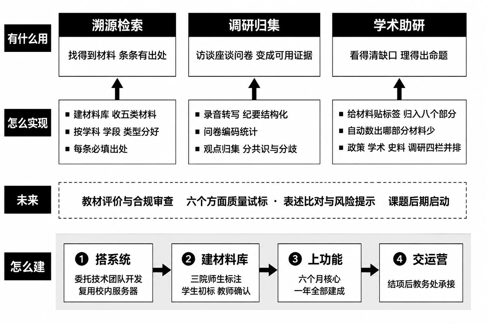

# 「教材智研」中国特色高质量教材体系研究智能体建设方案

SUBTITLE: 教育部大中小学课程教材研究项目《中国特色高质量教材体系的基础理论研究》配套建设　·　浙江省德育教材研究基地

## 一、定位与边界

新建面向教材体系研究的独立智能体"教材智研"，服务课题的三个专题，即分别研究教材体系"是什么""为什么""怎么做"。其需求与基地"禾灵儿"平台面向的德育资源推送不同，独立建设便于语料、权限与运营自成一体，也便于结项后移交教务处。

课题以文献研究为基础，同时要做专家访谈、座谈会与问卷调研。这些一手材料是本智能体重点学习和处理的内容：它们与政策文本、学术文献、历史史料并列入库，用同一套标签体系归位，可与文献材料并排检索比对。

为实现溯源检索、调研归集与学术助研三项功能，师生共同完成材料收集、转写编码、贴标签、并排比对与计数统计；范畴界定、命题提炼与结论判断，由课题组与相关专家作出。硬规则：无出处不入库、不交付。核心功能、实现方式与建设路径如图1所示。

## 二、三项功能

**溯源检索：把材料收齐、出处记清。** 收政策文本、学术文献、历史史料、教材与调研材料五类，每条都登记出处：文件名称与文号、条款序号、文献题名、史料来源、教材版次与页码、访谈或问卷的编号与时间；同时按所属学科、适用学段（小学至高等教育）和教育类型（普通教育、职业教育、继续教育）分类存放。材料按课题的五个核心概念建索引，即"中国特色""高质量""教材国家事权""教材体系""中国自主知识体系"；每个概念下再分四类依据：理论依据（学理上讲不讲得通）、历史依据（历史上是怎么做的）、制度依据（现行文件是怎么规定的）、现实依据（当下实践是什么状况）。研究者打开任一概念，就能看到四类依据各有多少条、哪一类还是空白。

**调研归集：把访谈、座谈、问卷变成可用的研究证据。** 一手材料若只以录音和纸质问卷留存，写作时很难反复调用。智能体对其做三件事。一是转成结构化记录：访谈录音转写为文字后按问题分段，每段登记受访者代号、单位类别、访谈时间与问题编号；座谈纪要按"议题—发言人—观点"拆分；问卷题目与选项统一编码。受访者与填答者一律以代号出现，不保留真实姓名与可识别信息。二是贴标签归位：与其他材料使用同一套标签，归入教材体系的八个部分、挂到五个核心概念名下，使一条访谈观点能与一条政策条款、一篇文献出现在同一检索结果中。三是观点归集与统计：同一问题下把不同专家的说法归到一起，标出哪些是共识、哪些存在分歧；问卷按题目出分布，并可按学段、学科、教师职称交叉分析。

由此产生三项作用。第一，一手材料变成可引证的证据，每条观点都带出处（受访者代号、访谈时间、问题编号；问卷题号与样本量），可直接用于研究报告与著作。第二，形成四方对照：政策怎么规定、学界怎么讨论、历史上怎么做、一线怎么看。政策话语向学术话语的转化，由此既有文献支撑，也有实践检验。第三，指导下一轮调研：哪个部分、哪个概念缺一手材料，哪个问题上专家分歧最大，系统都会显示出来，作为下一轮访谈提纲与问卷题目的依据，形成"调研—分析—再调研"的循环。

**学术助研：把材料理顺、把缺口和线索找出来。** 一是贴标签归位。课题把教材体系拆成八个部分，每条材料贴上标签、归入相应部分：价值体系（为谁培养人）、知识体系（用什么知识培养人）、话语体系（用什么方式表达）、标准体系（什么样才算高质量）、类型体系（用哪些教材培养人）、形态体系（用纸质、数字还是配套资源）、治理体系（编写审核选用怎么管）、重大专项体系（重点建哪些专项教材）。系统自动统计每个部分现有多少条材料，哪一部分长期偏少，就说明这一块的论证缺支撑，应及早补检索或补调研。二是四栏并排。输入一条政策提法，系统把它在四处的说法并排摆出：政策栏显示它出现在哪些文件、措辞怎么演变、对应哪个文号条款；学术栏显示学界怎么讨论、对应哪个学术概念、出自哪篇文献；历史栏显示历史上的制度依据与实际做法；调研栏显示专家访谈与问卷中一线的实际看法。四栏一并排，研究者就能判断哪些政策提法可以提炼成学术命题、还缺什么论证——这正是课题最难的一环。

## 三、未来功能：教材评价与合规审查

该功能不列入本期建设内容，待课题后期启动。设想包含两项：一是质量试标，按政治性（方向对不对）、科学性（知识准不准）、教学性（好不好教、好不好学）、规范性（体例、术语、引证规不规范）、时代性（内容新不新）、原创性（是不是自主编写、用的是不是中国案例）六个方面，抽小样本由两人独立标注并比对吻合程度，为质量标准提供实测依据；二是表述比对，把待审教材文本与政策库中的现行规范表述逐句比对，标出存疑之处并附文号条款，供专家复核。该功能涉及判断责任与送审程序，需在前三项功能积累足够材料、标注口径稳定之后再作论证，届时另行报批。

## 四、任务分工

各方职责、具体任务与交付物见表1。分工原则：定标准与作判断由课题组和专家承担，程序性作业由学生承担，系统实现由技术团队承担，日常协调由基地办公室承担。

TABLE: {{tbl:duty}}　任务分工

| 承担方 | 主要职责 | 具体任务 | 交付物 |
|---|---|---|---|
| 课题组 | 定标准、作判断 | 制定规范手册、访谈提纲与问卷；确定标签口径；裁定分歧；审定共识与分歧结论 | 规范手册、提纲问卷、仲裁记录 |
| 基地办公室 | 统筹协调 | 招募排班、进度跟踪、对接三院与技术团队、入库审核 | 周进度表、入库台账 |
| 技术团队 | 系统实现 | 搭建材料库、检索、标签统计、四栏并排与转写编码辅助 | 三个节点版本、操作说明 |
| 马克思主义学院师生 | 政策与史料 | 政策文本与教材建设史料的收集、录入与贴标签；参与访谈记录 | 政策条款卡、史料卡 |
| 教育学院师生 | 教材理论与教学 | 教材理论与课程论文献的收集与贴标签；问卷题目审核与统计 | 文献卡、问卷统计表 |
| 文法学院师生 | 文本与表述 | 访谈录音转写、座谈纪要结构化、体例规范核对 | 转写稿、纪要记录 |
| 本科生标注员 | 初标与录入 | 录入材料、著录出处、初步贴标签、转写初稿 | 每周合格件数 |
| 研究生助研 | 复核与分析 | 交叉复核算吻合度、观点归集、问卷交叉分析 | 复核记录、分析简报 |
| 咨询专家 | 校准与论证 | 接受访谈与座谈、审定标签口径、论证共识与分歧 | 访谈记录、论证意见 |
| 教务处 | 后期运营 | 承接账号权限、材料更新与下架、年度报告 | 运行年度报告 |

标注作业分三级：本科生初标与录入，研究生交叉复核并计算两人结果的吻合度，教师与专家抽检确认；抽检比例不低于百分之十，不合格批次整批返工。分歧不作多数决，登记后由课题组裁定，结论回填规范手册。

三个学院与材料类型对口：马克思主义学院（中共党史党建学院）对应政策文本与教材建设史料，教育学院对应教材理论与教学判断，文法学院对应文本表述与体例规范。各院指定带队教师，负责本院招募、培训、任务分派与标签口径指导。

激励：学生参与计入实践学时，达标者出具实践证明。

## 五、进度与运营

2026年6至7月搭系统、定规范与访谈提纲、招募培训并启动材料入库；8至9月溯源检索上线，第一轮专家访谈与座谈开展并转写入库；10至11月调研归集上线，问卷发放与回收统计，核心功能建成；2026年12月至2027年5月学术助研上线，四栏并排与覆盖度视图投入使用，并按缺口开展第二轮调研，全部功能建成，此后转入常态运行。

结项后由学校教务处承接运营，移交系统、材料库、规范手册与调研材料台账，负责权限管理、材料更新与年度报告；调研材料按约定的保密与匿名要求继续管理，运维支出纳入教务处日常经费。
