浙江省社科规划“党的二十届四中全会和省委十五届八次全会精神研究阐释”专项课题项目研究报告

报告名称：新质生产力赋能共同富裕的浙江实践与“十五五”路径研究——基于“势能—动能—效能”三阶转化框架的理论与实证

成果作者：蔡鑫宇

所在单位：嘉兴大学

形成时间：2026年6月30日

---

# 新质生产力赋能共同富裕的浙江实践与“十五五”路径研究——基于“势能—动能—效能”三阶转化框架的理论与实证

---

摘要：党的二十届四中全会通过的《中共中央关于制定国民经济和社会发展第十五个五年规划的建议》将“因地制宜发展新质生产力”与“推动人的全面发展、全体人民共同富裕迈出坚实步伐”确立为“十五五”时期相互贯通的重大命题；省委十五届八次全会通过浙江省“十五五”规划建议，确立了高质量发展建设共同富裕示范区取得决定性进展的总目标。本报告聚焦新质生产力发展与共同富裕推进之间“创新极化—均衡共享”的内在张力，提出“共富型新质生产力”概念，构建“势能—动能—效能”三阶转化理论框架，将新质生产力赋能共同富裕的机制解构为创新势能积蓄、产业动能转换、富民效能释放三个阶段和成果转化、就业分配、人力资本反哺三大转化关口，并阐明关口失灵与城乡、地区、收入“三大差距”生成机理的对应关系。在此基础上，报告以2015—2024年浙江省数据为样本，综合运用熵值法、耦合协调度模型和模糊集定性比较分析（fsQCA）三种方法开展实证检验。研究发现：（1）浙江新质生产力发展指数与共同富裕指数十年间分别由0.130、0.108提高至0.802、0.824，两大系统高度同向共进（相关系数0.9941），耦合协调度由0.345（轻度失调）跃升至0.902（优质协调），经历磨合追赶、协调起步、高水平耦合跃升三个阶段，共同富裕示范区建设启动后四年间先后跃上中级、良好、优质三个协调等级，呈现明显加速态势；（2）2024年共同富裕指数（0.824）反超新质生产力发展指数（0.802），改变了2020年以来后者单边领先的格局，共同富裕对新质生产力的反哺效应开始显现，“双向赋能”命题得到经验支持；（3）基于31个省份的组态分析识别出“创新—人才引领型”与“创新—民营协同型”两条高共富绩效路径，创新投入、数字普惠金融与城镇化构成核心条件组合，浙江是同时落入两条路径且以民营经济活力为最具辨识度条件的“全要素协同型”省份，而“创新孤岛型”非高绩效组态则从反面印证了转化关口失灵的理论命题。报告最后立足三大转化关口与制度转化器，提出“十五五”时期建设创新浙江厚积创新势能、实施“人工智能+”畅通势能转化、壮大现代化产业体系扩容就业质量、深化山海协作畅通空间传导、健全分配制度做实扩中提低、推进公共服务一体化夯实反哺循环等六条深化路径。

关键词：新质生产力；共同富裕；耦合协调；组态分析；浙江实践

---

## 一、引言

### （一）研究背景与问题提出

党的二十届四中全会于2025年10月20日至23日在北京举行，审议通过《中共中央关于制定国民经济和社会发展第十五个五年规划的建议》（以下简称《建议》）〔R:jianyi〕，明确指出“‘十五五’时期在基本实现社会主义现代化进程中具有承前启后的重要地位”，是“基本实现社会主义现代化夯实基础、全面发力的关键时期”。审视《建议》的总体布局，一条贯穿始终的主线是生产力命题与民生命题的内在统一。一方面，《建议》在“坚持高质量发展”的原则中要求“以新发展理念引领发展，因地制宜发展新质生产力”，并在第四部分专章部署“加快高水平科技自立自强，引领发展新质生产力”，强调“抓住新一轮科技革命和产业变革历史机遇，统筹教育强国、科技强国、人才强国建设，提升国家创新体系整体效能，全面增强自主创新能力，抢占科技发展制高点，不断催生新质生产力”；另一方面，《建议》确立了“推动人的全面发展、全体人民共同富裕迈出坚实步伐”的目标要求，第十一部分明确“实现人民对美好生活的向往是中国式现代化的出发点和落脚点”，提出“使居民收入增长和经济增长同步、劳动报酬提高和劳动生产率提高同步”、持续扩大中等收入群体等制度安排。这表明，“十五五”时期的发展命题已不再是“先做大蛋糕、后分好蛋糕”的时序问题，而是生产力跃迁与共享发展如何在同一进程中相互成就的结构问题。

省委十五届八次全会于2025年11月14日在杭州举行，审议通过《中共浙江省委关于制定浙江省国民经济和社会发展第十五个五年规划的建议》〔R:zjjianyi〕，确立了“高质量发展建设共同富裕示范区取得决定性进展，率先呈现基本实现社会主义现代化的生动图景”的“十五五”总目标，《建议》起草说明进一步指出，“十五五”时期是浙江持续夯实基础、全面发力、突破提升、高质量发展建设共同富裕示范区的决定性阶段。全会一方面部署加快建设创新浙江、因地制宜发展新质生产力，以人工智能为核心变量、以先进制造业为骨干打造浙江特色现代化产业体系；另一方面明确“把缩小城乡差距、地区差距、收入差距作为主攻方向”，并提出到2030年人均地区生产总值接近发达经济体水平（约17万元）、全社会研发投入强度3.5%以上、居民人均可支配收入9万元左右、城乡居民收入倍差缩小至1.8以内等量化目标。可以看出，中央部署与浙江落点高度同构：发展新质生产力与扎实推进共同富裕，构成同一张“十五五”施工图的两翼。

然而，两翼齐飞并非自然而然，其间存在深刻的理论张力，本报告将其概括为“创新极化—均衡共享”悖论。从生产力运行规律看，新质生产力以科技创新为主导，创新要素因知识溢出的局域性与收益递增效应而天然趋向高能级城市集聚，呈现显著的空间极化特征；从生产关系的价值要求看，共同富裕强调发展成果的普惠共享与空间均衡，二者在机理上存在紧张关系。这一张力在经验层面具有典型化表现：就全国而言，2024年城乡居民收入倍差仍达2.34；就浙江省内而言，创新要素的极化同样明显——全省10家省实验室中7家布局于杭州，2024年杭州数字经济核心产业增加值达6305亿元、占其GDP的28.8%，占全省数字经济核心产业增加值（11060亿元）的比重超过一半，11个设区市人均GDP最高最低倍差为2.20、居民收入最高最低倍差为1.54。但耐人寻味的是，作为数字经济先发省与区域创新能力稳居全国第4的创新大省，浙江同时是全国城乡差距最小的省份之一：2024年城乡居民收入倍差1.83、显著低于全国的2.34，农村居民收入连续40年居全国省区第一，所有设区市居民收入均超过全国平均水平（全国唯一）。作为全国唯一的共同富裕示范区，浙江在创新领先与差距收敛之间实现的“并存”，为破解“极化—共享”悖论提供了极为珍贵的“实践原型”。由此，本报告的核心问题可分解为三个递进层次：其一，新质生产力究竟经由何种机制链条赋能共同富裕，链条的哪些环节容易断裂？其二，浙江两大系统的协同演进达到了何种水平、呈现何种阶段特征，其背后的机制归因是什么？其三，“十五五”时期浙江应沿何种路径深化这一实践，使之上升为可复制、可推广的制度性经验？

### （二）国内外研究现状

围绕上述问题，既有研究大体沿三条脉络展开。第一支是新质生产力研究。自2023年9月习近平总书记提出这一重大概念以来，学界围绕其科学内涵、生成逻辑与测度方法形成了较为丰富的成果〔R:zhouwen,hongyinxing〕，普遍认为新质生产力以科技创新为主导、以全要素生产率大幅提升为核心标志，并尝试从劳动者、劳动资料、劳动对象及其优化组合的跃升出发构建评价指标体系，考察其区域差异与动态演进。第二支是共同富裕研究。伴随共同富裕示范区建设的推进，研究重心从内涵阐释转向量化测度与路径设计，多从富裕性、共享性、可持续性等维度构建指数〔R:liupeilin,wanhaiyuan,chenlijun〕，并围绕缩小城乡差距、地区差距、收入差距的实现机制展开讨论〔R:lishi〕，形成了收入分配、公共服务、城乡融合等多个政策研究方向。第三支是二者关系研究，目前尚处起步阶段：既有成果或从理论上阐释新质生产力对共同富裕的支撑作用，或以计量模型检验前者对后者的线性促进效应，初步确认了“生产力发展有利于共同富裕”的总体判断。

既往研究为本报告奠定了重要基础，但对照“十五五”时期统筹发展新质生产力与扎实推进共同富裕的实践需要，仍存在三点不足。一是“机制黑箱”。多数研究停留在“新质生产力促进共同富裕”的总量判断，缺乏对“创新投入—产业转化—就业分配—收入改善”这一传导链条的环节化刻画，难以回答赋能过程在哪个关口容易中断、断点如何与“三大差距”的生成机理相对应，理论解释力受限。二是“单向视角”。既有文献多考察生产力对共同富裕的单向促进，较少关注共同富裕通过人力资本积累、内需市场扩容、社会预期稳定等渠道对新质生产力的反哺效应，对两大系统耦合互动、双向赋能的动态关系缺乏系统建模与实证检验。三是“经验碎片”。相关案例研究多为点状经验的罗列，缺少以一个完整省域为样本、贯通“理论建构—历程考察—水平测度—组态比较”的系统性研究；尤其是浙江作为全国唯一共同富裕示范区兼数字经济先发省的双重身份所蕴含的样本价值，尚未在全国坐标系中得到充分定位。弥补上述不足，正是本报告的努力方向。

### （三）研究思路、方法与边际贡献

在研究思路上，本报告遵循“理论构建—实践考察—实证检验—路径设计”的四步框架。第一步，理论构建：提出“共富型新质生产力”概念，构建“势能—动能—效能”三阶转化分析框架，界定创新势能、产业动能、富民效能三个阶段及其间的三大转化关口（成果转化关、就业分配关、人力资本反哺关），阐明关口失灵与“三大差距”生成机理的对应关系，并纳入双向赋能机制与“有为政府×有效市场×有感社会”的制度转化器，据此提出可检验的研究命题。第二步，实践考察：系统回顾浙江统筹新质生产力发展与共同富裕示范的探索历程，提炼典型化事实，形成待检验的经验假说。第三步，实证检验：以三个递进的实证模块对理论命题进行检验。第四步，路径设计：立足实证发现，围绕三大转化关口与制度转化器，提出“十五五”时期深化浙江实践的政策路径。

在研究方法上，本报告综合运用三种互补的实证工具。一是熵值法指数测度。基于2015—2024年浙江省时间序列数据，采用极值标准化与熵值法客观赋权，分别测度新质生产力发展指数（U1）与共同富裕指数（U2），以规避主观赋权可能引致的测度偏误，刻画两大系统各自的水平演进与结构特征。二是耦合协调度模型。借鉴系统科学中的耦合理论，通过耦合度、综合协调指数与耦合协调度（D）的测算及等级划分，考察两大系统协同演化的时序轨迹与阶段跃迁，检验“耦合协调度随时间上升”的理论命题。三是模糊集定性比较分析（fsQCA）。以全国31个省（自治区、直辖市）为案例，以共富绩效为结果变量，纳入创新投入强度、数字普惠金融、人力资本水平、民营经济活力、城镇化水平五个条件变量，运用直接校准法与组态分析识别高共富绩效的多元等效路径。选择fsQCA基于双重考量：从方法论适配性看，共同富裕是多重条件并发作用的复杂结果，组态视角能够捕捉“殊途同归”的等效路径与因果非对称性〔R:duyunzhou2017〕，弥补传统回归“净效应”思维之不足；从研究情境适配性看，31个省份构成的中等规模样本恰为QCA方法的适用区间〔R:pappas〕，且便于在全国坐标系中定位“浙江组态”。

在边际贡献上，本报告力求在三个层面有所推进。一是理论层面，提出“共富型新质生产力”概念与“势能—动能—效能”三阶转化框架，以三大转化关口打开新质生产力赋能共同富裕的“机制黑箱”，并将关口失灵与城乡差距、地区差距、收入差距的生成机理相对接，为理解“极化—共享”悖论的破解提供了整合性分析工具。二是实证层面，首次对浙江省新质生产力与共同富裕两大系统进行系统性的指数测度与耦合协调分析，以十年时序数据刻画两大系统从失调到协调的演化全景，为“示范区建设成效”提供了可量化的学理证据。三是比较层面，以fsQCA识别共富型发展的多元组态路径，将浙江经验置于全国31个省份的组态坐标中加以定位，回答了“浙江路径是什么、何以独特、能否推广”的问题，为其他地区因地制宜借鉴浙江经验提供了参照系。

本报告余下部分安排如下：第二章阐释两个全会关于新质生产力与共同富裕的部署逻辑；第三章构建“共富型新质生产力”与“势能—动能—效能”三阶转化的理论框架；第四章给出理论框架的数理模型，推导可检验的模型命题；第五章考察浙江实践的探索历程与典型化事实；第六章说明研究设计；第七至九章依次报告水平测度与障碍度诊断、耦合协调的时序演进与稳健性检验、跨省组态分析的实证结果；第十章在粤苏鲁浙四省坐标中定位浙江方位；第十一章提出“十五五”路径与政策建议；第十二章总结全文。

## 二、党的二十届四中全会与省委十五届八次全会关于新质生产力与共同富裕的部署逻辑

准确把握新质生产力与共同富裕在党和国家战略体系中的部署逻辑，是本研究得以展开的政策原点。党的二十届四中全会审议通过的《中共中央关于制定国民经济和社会发展第十五个五年规划的建议》（以下简称《建议》）与省委十五届八次全会审议通过的浙江省“十五五”规划建议，分别在国家层面与省域层面对“因地制宜发展新质生产力”与“扎实推进全体人民共同富裕”作出系统安排。本章循“中央部署—理论渊源—浙江落点—内在逻辑”的次序，对两个全会的文本结构与部署逻辑进行学理化解读，为后续理论构建与实证检验确立政策坐标。

### （一）党的二十届四中全会的战略部署：从“两大命题”到“一个统一体”

党的二十届四中全会于2025年10月20日至23日召开，审议通过的《建议》约2万字、15个部分、三大板块，是指导“十五五”时期经济社会发展的纲领性文件。全会明确，“‘十五五’时期在基本实现社会主义现代化进程中具有承前启后的重要地位”，是“基本实现社会主义现代化夯实基础、全面发力的关键时期”。尤为值得注意的是《建议》指导思想的表述结构：“以推动高质量发展为主题，以改革创新为根本动力，以满足人民日益增长的美好生活需要为根本目的……推动经济实现质的有效提升和量的合理增长，推动人的全面发展、全体人民共同富裕迈出坚实步伐，确保基本实现社会主义现代化取得决定性进展”。在这一表述中，“质的有效提升和量的合理增长”与“全体人民共同富裕迈出坚实步伐”被并置于同一目标函数之内，生产力命题与共同富裕命题在指导思想层面即被锚定为不可分割的整体，这构成理解《建议》全部部署的总纲。

就生产力命题而言，《建议》形成了“原则—产业—科技”三层递进的部署链条。一是在“坚持高质量发展”原则中明确“以新发展理念引领发展，因地制宜发展新质生产力，做强国内大循环，畅通国内国际双循环……加快培育新动能，促进经济结构优化升级，做优增量、盘活存量”，将新质生产力确立为高质量发展的动力内核。二是在“建设现代化产业体系，巩固壮大实体经济根基”部分强调“现代化产业体系是中国式现代化的物质技术基础。坚持把发展经济的着力点放在实体经济上，坚持智能化、绿色化、融合化方向……保持制造业合理比重，构建以先进制造业为骨干的现代化产业体系”，并前瞻部署“推动量子科技、生物制造、氢能和核聚变能、脑机接口、具身智能、第六代移动通信等成为新的经济增长点”。三是以专门部分部署“加快高水平科技自立自强，引领发展新质生产力”，提出“中国式现代化要靠科技现代化作支撑。抓住新一轮科技革命和产业变革历史机遇，统筹教育强国、科技强国、人才强国建设，提升国家创新体系整体效能，全面增强自主创新能力，抢占科技发展制高点，不断催生新质生产力”，其下设的加强原始创新和关键核心技术攻关、推动科技创新和产业创新深度融合、一体推进教育科技人才发展、深入推进数字中国建设四个方面，恰好覆盖了创新势能的积蓄与释放全链条；“全面实施‘人工智能+’行动，以人工智能引领科研范式变革，加强人工智能同产业发展、文化建设、民生保障、社会治理相结合，抢占人工智能产业应用制高点，全方位赋能千行百业”的部署，则为势能向产业动能的转化指明了通用技术路径。

就共同富裕命题而言，《建议》第十一部分“加大保障和改善民生力度，扎实推进全体人民共同富裕”开宗明义：“实现人民对美好生活的向往是中国式现代化的出发点和落脚点。坚持尽力而为、量力而行，加强普惠性、基础性、兜底性民生建设，解决好人民群众急难愁盼问题，畅通社会流动渠道，提高人民生活品质。”在目标层面，《建议》将民生目标细化为“高质量充分就业取得新进展，居民收入增长和经济增长同步、劳动报酬提高和劳动生产率提高同步，分配结构得到优化，中等收入群体持续扩大，社会保障制度更加优化更可持续，基本公共服务均等化水平明显提升”；在城乡与区域维度，明确“坚持农业农村优先发展，坚持城乡融合发展……缩小城乡发展差距”、“学习运用‘千万工程’经验”，并强调“区域协调发展是中国式现代化的内在要求……巩固提升京津冀、长三角、粤港澳大湾区高质量发展动力源作用”。

更进一步的文本细读表明，《建议》并非将两大命题作平行罗列，而是以三重机制将其缝合为“一个统一体”。其一，“十五五”七方面主要目标中，“高质量发展取得显著成效”与“人民生活品质不断提高”同列并举，且高质量发展目标本身即包含“经济增长保持在合理区间，全要素生产率稳步提升，居民消费率明显提高，内需拉动经济增长主动力作用持续增强”——全要素生产率（生产力指标）与居民消费率（民生指标）同框，意味着增长质量的评判标准内嵌了共享维度。其二，“两个同步”即“使居民收入增长和经济增长同步、劳动报酬提高和劳动生产率提高同步”，把分配规则直接锚定于生产率变量，从制度上规定了生产力增量必须按同步比例转化为居民收入增量。其三，2035年远景目标“人均国内生产总值达到中等发达国家水平，人民生活更加幸福美好，基本实现社会主义现代化”，以人均量纲统摄发展与共享的双重内涵。由此观之，四中全会的部署逻辑，正是本研究“势能—动能—效能”三阶转化命题在国家规划文本中的典型化呈现。

### （二）习近平经济思想中生产力与共同富裕的理论一脉

四中全会的部署并非孤立的规划安排，而是习近平经济思想中生产力理论与共同富裕理论长期演进、彼此贯通的规划化表达。从时序看，共同富裕的系统论述在先。2021年8月17日，习近平总书记在中央财经委员会第十次会议上发表重要讲话（后以《扎实推动共同富裕》为题刊于《求是》2021年第20期）〔R:xi2021〕，明确指出“共同富裕是社会主义的本质要求，是中国式现代化的重要特征”，强调“要坚持以人民为中心的发展思想，在高质量发展中促进共同富裕”。“在高质量发展中促进共同富裕”这一方法论命题，从一开始就否定了脱离生产力发展谈分配的路径，确立了以发展为前提、以共享为取向的分析基线。

新质生产力概念的提出与体系化则回答了“以何种发展促进共同富裕”的问题。2023年9月，习近平总书记在黑龙江考察期间首次提出“新质生产力”；2024年1月31日，在中央政治局第十一次集体学习时给出经典界定〔R:xi2024〕：“概括地说，新质生产力是创新起主导作用，摆脱传统经济增长方式、生产力发展路径，具有高科技、高效能、高质量特征，符合新发展理念的先进生产力质态。”并指出“新质生产力主要由技术革命性突破催生而成，科技创新是发展新质生产力的核心要素”。这一界定以“符合新发展理念”为限定语，而新发展理念中的共享理念本身即指向共同富裕，故新质生产力自其概念生成之时便携带着价值规定性，并非单纯的效率范畴。

贯通两大命题的理论枢纽，是关于新型生产关系的重要论断：“发展新质生产力，必须进一步全面深化改革，形成与之相适应的新型生产关系。”依循历史唯物主义的分析框架，生产力的质态跃迁必然要求生产关系的适应性变革，而分配关系是生产关系的核心构成——共同富裕所要求的分配结构优化、中等收入群体扩大、基本公共服务均等化，正是与新质生产力相适应的新型生产关系在分配与再分配领域的具体展开。由此，“新质生产力—新型生产关系—共同富裕”构成一条完整的理论链条，四中全会《建议》则是这条理论链条在“十五五”时期的任务化、指标化落地。

### （三）省委十五届八次全会的浙江落点

省委十五届八次全会于2025年11月14日在杭州召开，审议通过《中共浙江省委关于制定浙江省国民经济和社会发展第十五个五年规划的建议》。全会主题鲜明：深入学习贯彻党的二十届四中全会精神和习近平总书记考察浙江重要讲话精神，深入践行“八八战略”，高质量发展建设共同富裕示范区、加快打造“重要窗口”、奋力谱写中国式现代化浙江新篇章。全会确立的“十五五”总目标是“高质量发展建设共同富裕示范区取得决定性进展，率先呈现基本实现社会主义现代化的生动图景”；《建议》起草说明进一步阐明，“十五五”时期是浙江持续夯实基础、全面发力、突破提升、高质量发展建设共同富裕示范区的决定性阶段。这意味着浙江的“十五五”叙事以共同富裕示范区为核心任务统领全局，新质生产力发展被内置于共富示范的总体框架之中。

从目标体系看，省全会确定的2030年量化目标呈现出鲜明的“双重锚定”特征：生产力侧，人均地区生产总值接近发达经济体水平（约17万元）、全社会研发投入强度3.5%以上、全员劳动生产率30万元/人左右；共富侧，居民人均可支配收入9万元左右、常住人口城镇化率78%左右、城乡居民收入倍差缩小至1.8以内。生产率指标与收入分配指标同表共列、互为约束，正是四中全会“一个统一体”部署逻辑的省域投影。从任务体系看，“六个重大突破”中，“创新浙江建设、现代化产业体系构建实现重大突破，科创高地、先进制造业基地和人工智能创新发展高地全球竞争力影响力更加凸显”与“城乡一体融合高质量发展实现重大突破，全体人民共享高品质幸福生活更加可感可及”分别对应两大命题；10个方面重点任务中，加快建设创新浙江、因地制宜发展新质生产力被置于首位，同时明确“把缩小城乡差距、地区差距、收入差距作为主攻方向，充分运用‘千万工程’蕴含的理念方法机制，聚焦山区海岛县和农村农民，围绕‘富民’统筹推进‘强城’‘兴村’‘融合’三篇文章”。在具体抓手上，全会部署以人工智能为核心变量、以先进制造业为骨干、以现代服务业为重要支撑，深入实施“315”科技创新体系建设工程、“415X”先进制造业集群培育工程，提出全省规模以上人工智能核心产业营业收入达到1.2万亿元的量化目标；在教科人一体方面部署“双一流196”工程、“135”人才强省体系建设工程，深化“校（院）企双聘”、完善“科技副总”“产业教授”机制；在民营经济方面提出支持民企参与新能源、人工智能、低空经济等领域投资，铁路、核电等领域民企持股比例提高到10%以上，并推进杭甬温要素市场化配置综合改革试点。

对省全会的理解还须置于2025年浙江省级部署的完整链条中加以贯通。一是2025年3月省委一号文件出台《关于以“千万工程”牵引城乡融合发展缩小“三大差距”推进共同富裕先行示范的实施方案》〔R:zjsanda〕，明确“千万工程”是牵引、城乡融合高质量发展是根本路径、缩小“三大差距”是主攻方向、推进共同富裕先行示范是重大使命，并给出2027年山区海岛县居民收入与全省平均比值达77%、2030年城乡倍差缩小至1.8以内、2035年全省域基本实现共同富裕的阶梯式目标，回答了“共富怎么推”。二是2025年7月省委十五届七次全会审议通过《中共浙江省委关于加快建设创新浙江因地制宜发展新质生产力的决定》〔R:zjcxzj〕，确立“坚持教育科技人才一体改革发展为主要支撑、科技创新和产业创新深度融合为关键路径、人工智能为核心变量，加快建设创新浙江”的总体思路，强调“人工智能将成为创新浙江的最鲜明标识、最核心支撑”，回答了“生产力怎么育”。三是11月八次全会以“十五五”建议将前两者整合进五年规划框架，回答了“两者怎么统”。三份文件依次递进、首尾闭合，表明浙江已在制度设计层面自觉地将新质生产力培育与“三大差距”缩小纳入同一政策回路，这为本研究提出的共富型新质生产力概念提供了最直接的实践注脚。

### （四）两大命题统一于中国式现代化的内在逻辑

从学理层面审视，两个全会将新质生产力与共同富裕并轨部署，其深层依据在于生产力与生产关系的辩证运动规律。新质生产力代表生产力的质态跃迁，共同富裕则集中体现生产关系尤其是分配关系的优化方向；“形成与之相适应的新型生产关系”的重要论断，为两者提供了理论接口——生产力跃迁若无分配制度的适应性变革，其成果无法普惠于民；分配制度变革若无生产力跃迁的支撑，则将陷于无源之水。中国式现代化正是在这一辩证结构中同时容纳了“做大蛋糕”与“分好蛋糕”的双重要求。

进一步看，这一统一体呈现为双向的因果结构。一方面，高质量发展是共同富裕的物质前提。“两个同步”的经济学含义在于，劳动报酬的可持续提高以劳动生产率的提高为上限约束，居民收入的持续增长以经济增长为总量边界；离开全要素生产率的稳步提升，任何收入增长目标都不具备可持续性。浙江2030年目标中全员劳动生产率30万元/人左右与居民人均可支配收入9万元左右的并列设定，正体现了以生产率锚定收入的目标设计逻辑。另一方面，共同富裕是高质量发展的价值归宿，同时也是其动力来源。《建议》提出“居民消费率明显提高，内需拉动经济增长主动力作用持续增强”，其实现有赖于中等收入群体持续扩大所形成的需求侧支撑；基本公共服务均等化水平的提升，将扩大人力资本积累的社会覆盖面；“畅通社会流动渠道”则维系着创新创业的社会预期。共同富裕由此从单纯的分配结果转化为生产力再生产的投入变量，这正是理论框架部分所论“双向赋能”机制的政策依据。

综上，党的二十届四中全会与省委十五届八次全会的部署逻辑，可以凝练为“以新质生产力厚植共同富裕的物质基础，以共同富裕校准新质生产力的价值方向”。这一逻辑内在地要求打通从创新势能积蓄、产业动能转换到富民效能释放的完整转化链条，守好成果转化关、就业分配关、人力资本反哺关三大转化关口。两个全会的文本为本研究提供了双重坐标：中央部署给出了“因地制宜发展新质生产力”与“扎实推进全体人民共同富裕”相统一的国家框架，省委部署则给出了以创新浙江建设与缩小“三大差距”为两翼的浙江方案。后续章节将在此政策坐标之上，构建“共富型新质生产力”的理论框架，并以浙江2015—2024年的经验数据检验两大系统耦合协调的演进轨迹与机制条件。

## 三、“共富型新质生产力”与“势能—动能—效能”三阶转化框架

习近平总书记在中央政治局第十一次集体学习时深刻指出：“概括地说，新质生产力是创新起主导作用，摆脱传统经济增长方式、生产力发展路径，具有高科技、高效能、高质量特征，符合新发展理念的先进生产力质态。”在中央财经委员会第十次会议上，习近平总书记强调，“共同富裕是社会主义的本质要求，是中国式现代化的重要特征”，“要坚持以人民为中心的发展思想，在高质量发展中促进共同富裕”。党的二十届四中全会通过的《建议》进一步将“因地制宜发展新质生产力”与“推动人的全面发展、全体人民共同富裕迈出坚实步伐”纳入同一战略部署，省委十五届八次全会则明确提出“高质量发展建设共同富裕示范区取得决定性进展，率先呈现基本实现社会主义现代化的生动图景”的总目标。两大命题如何在省域尺度上实现内在贯通，既往研究或止于政策解读，或囿于单向的“生产力促共富”视角，尚未打开从创新投入到居民获得的完整传导链条这一“机制黑箱”。本章立足马克思主义政治经济学关于生产力与生产关系矛盾运动的基本原理，提出“共富型新质生产力”这一核心概念，构建“势能—动能—效能”三阶转化框架，刻画三大转化关口的失灵机理与制度修复逻辑，并在此基础上凝练三个可检验的研究命题，为后续的实践考察与实证检验提供统一的理论基准。

### （一）核心概念：“共富型新质生产力”

本报告将“共富型新质生产力”界定为：以全要素生产率提升为内核、以普惠共享为价值取向、创新势能能够顺畅转化为产业动能并最终沉淀为富民效能的生产力形态。习近平总书记指出，“新质生产力主要由技术革命性突破催生而成，科技创新是发展新质生产力的核心要素”。这一论断揭示了新质生产力的技术源头；而“共富型”的限定则进一步指明其运行方向——技术革命性突破所释放的生产力增量，必须经由生产、分配、流通、消费的社会再生产全过程，转化为全体人民可感可及的生活品质改善。据此，共富型新质生产力包含三重规定性。一是效率规定性，即以全要素生产率提升为内核。这与《建议》提出的“全要素生产率稳步提升”目标直接对应：脱离效率支撑的共享是低水平的均贫，唯有依靠创新驱动做大蛋糕，共同富裕才具备可持续的物质基础。二是结构规定性，即产业体系必须保持足够的就业包容度。新质生产力的产业载体若过度偏向资本密集与技能密集环节，则技术进步的红利将集中于少数要素所有者；只有当现代化产业体系能够创造规模可观、结构多元、质量较高的就业岗位时，生产力跃迁才能通过劳动报酬渠道惠及大多数劳动者，这正是《建议》将“高质量充分就业取得新进展”列入民生目标的深层逻辑。三是价值规定性，即发展成果的普惠共享。《建议》明确要求“使居民收入增长和经济增长同步、劳动报酬提高和劳动生产率提高同步”，“两个同步”构成检验生产力发展是否具有共富属性的价值标尺。

需要着重辨明的是，共富型新质生产力不是在一般新质生产力之外另立一种生产力类型，而是生产力跃迁与生产关系优化的统一形态。习近平总书记强调：“发展新质生产力，必须进一步全面深化改革，形成与之相适应的新型生产关系。”这意味着新质生产力命题本身即内含生产关系变革的要求；共富型新质生产力概念正是对这一要求的理论展开——它把“生产什么样的力”与“为谁生产、成果归谁”两个问题统一起来，直面新质生产力发展中的“极化—共享”张力：创新要素遵循集聚规律向高能级城市与头部主体集中，而共同富裕要求发展成果在城乡、区域、群体之间均衡分布。能否将创新集聚的“极化势能”转化为普惠共享的“扩散效能”，构成共富型新质生产力的核心理论问题，也是浙江作为全国唯一的共同富裕示范区（2021年6月中央出台《关于支持浙江高质量发展建设共同富裕示范区的意见》〔R:zjyijian〕）所承担的先行探路使命。

### （二）“势能—动能—效能”三阶转化机制

共富型新质生产力的运行过程，可以借助物理学“势能—动能—效能”的能量转化隐喻加以刻画，但每一阶段均须给出严格的经济学界定。1．创新势能（Potential），指科技、教育、人才三大要素长期积蓄形成的、尚未完全进入现实生产函数的知识资本与人力资本存量，其经济学实质是潜在全要素生产率，载体包括省实验室体系、高水平大学、新型研发机构与区域人才生态。势能的特征在于“位高而未动”：研发投入、专利产出、人才集聚本身并不直接构成产出增长，而是为后续转化储备了“位能”。2．产业动能（Kinetic），指创新势能经科技成果转化落入产业体系后形成的现实生产能力，其经济学实质是由技术进步驱动的产业增加值创造能力，载体包括数字经济核心产业、“415X”先进制造业集群、未来工厂与量大面广的民营经济主体。动能的特征在于“动而生值”：只有当新技术物化为新产品、新工艺、新业态，势能才转化为可度量的经济增长。3．富民效能（Effectiveness），指产业动能经由就业创造、收入分配、公共服务三条渠道传导后形成的居民可支配收入增长与生活品质改善，其经济学实质是生产力发展成果向居民福利的最终沉淀，载体表现为就业岗位、劳动报酬、财产性与转移性收入以及均等化的公共服务供给。三阶依次转化、闭环运行，构成共富型新质生产力的完整链条。

链条的关键在于三大转化关口，它们既是能量传导的枢纽，也是最易发生断裂的节点，且每一关口的失灵都对应着一类差距的生成机理。关口Ⅰ为成果转化关（势能→动能）。科技成果从实验室走向生产线，需要跨越中试熟化、风险资本、应用场景等多重门槛；一旦转化通道不畅，创新势能便滞留于少数高能级平台，形成“创新孤岛”——研发投入高企而周边区域难以分享产业化红利。由于创新要素天然向中心城市集聚（如全省10家省实验室中7家布局杭州），若缺乏跨区域的成果扩散与产业转移机制，关口Ⅰ失灵将直接加剧地区差距。关口Ⅱ为就业分配关（动能→效能）。技术进步具有资本偏向与技能偏向特征，自动化与智能化在提升劳动生产率的同时可能压缩中低技能岗位、压低劳动报酬份额，导致“增长不增收”——产业动能强劲而居民收入增长滞后于经济增长。关口Ⅱ失灵意味着“两个同步”落空，初次分配格局恶化，直接加剧收入差距。关口Ⅲ为人力资本反哺关（效能→势能）。富民效能若不能通过教育、医疗等公共服务转化为下一轮人力资本积累，低收入群体与农村居民将被锁定在低技能—低收入—低积累的“低水平循环”之中，其子代难以进入创新部门就业；关口Ⅲ失灵使城乡之间的人力资本差距代际传递，固化城乡差距。由此，“三大差距”并非外生于新质生产力发展的孤立现象，而是三大转化关口失灵的系统性后果；省委十五届八次全会提出“把缩小城乡差距、地区差距、收入差距作为主攻方向”，在本框架中即表现为对三大关口的靶向修复。

### （三）双向赋能与动态耦合

共同富裕不仅是新质生产力发展的结果变量，更是其投入变量——这是本框架区别于单向赋能论的关键命题。共同富裕反哺新质生产力的渠道有三。一是人力资本积累渠道。教育公平与公共服务均等化提升全社会劳动力质量，扩大创新人才的供给基数，直接充实创新势能；共享度的提高意味着人力资本投资在城乡、区域间更均衡地配置，从而提升全省人力资本存量的边际产出。二是内需市场扩容渠道。中等收入群体持续扩大形成规模化、多层次的国内需求，《建议》提出“居民消费率明显提高，内需拉动经济增长主动力作用持续增强”，需求引致创新机制由此启动——庞大且升级中的消费市场为新技术、新产品提供了商业化验证场景，降低了创新的市场风险。三是社会预期稳定渠道。更加优化更可持续的社会保障制度降低居民预防性储蓄动机与创业就业的后顾之忧，稳定企业家投资预期，提高全社会的风险承担意愿与创新容错空间。三条渠道共同作用，使富民效能回流为创新势能，形成“生产力跃迁—共同富裕—更高水平生产力跃迁”的双螺旋上升结构。

基于双向赋能逻辑，本框架进一步提出两大系统耦合协调的动态演化阶段假说：在发展初期，新质生产力系统与共同富裕系统各自水平较低、互动微弱，处于低水平耦合阶段；随着创新投入加码与分配制度完善，两系统进入磨合提升阶段，转化关口逐一打通，耦合协调度稳步上升但仍存在阶段性错位（如技术冲击期的收入波动）；当三大关口全部实现制度化修复、双向赋能渠道充分畅通后，两系统进入高水平协调阶段，呈现同频共振、互促共进的稳态特征。这一假说将在实证章借助新质生产力发展指数（U1）、共同富裕指数（U2）与耦合协调度（D）的时序测度加以检验。

### （四）制度转化器：有为政府×有效市场×有感社会

三阶转化不会自动完成，关口能否打通取决于制度供给的质量。《建议》将“坚持有效市场和有为政府相结合”列为“十五五”时期经济社会发展必须遵循的原则，本框架在此基础上引入“有感社会”维度，提出“有为政府×有效市场×有感社会”三位一体的制度转化器概念：制度供给的功能在于降低三大关口的转化成本——降低成果转化关的信息搜寻与风险分担成本，降低就业分配关的劳动力市场匹配与再分配执行成本，降低人力资本反哺关的公共服务可及成本。有为政府以规划引领与改革供给校正市场失灵，浙江二十余年一以贯之实施“八八战略”、接续推进共同富裕示范区与创新浙江建设，体现了规划的连续性对转化预期的稳定作用；有效市场以充分竞争与要素流动提高转化效率，浙江民营经济增加值占GDP的67.4%（2024年），量大面广的民营主体构成势能落地为动能的最活跃承接面；有感社会以数字治理与基层善治增强成果分配的可及性与精准性，使富民效能真正抵达“最后一公里”。

浙江的标志性制度安排与三大关口存在清晰的对应关系：山海协作工程（2002年启动）及其“产业飞地”“科创飞地”机制，通过跨区域的产业合作与创新资源输送修复关口Ⅰ的空间断点，遏制“创新孤岛”对地区差距的放大；“千万工程”（2003年启动）、强村公司与“扩中提低”改革，通过壮大集体经济、拓宽增收渠道修复关口Ⅱ的分配断点，保障“增长必增收”；教育科技人才一体改革发展与基本公共服务一体化，通过均衡配置人力资本投资修复关口Ⅲ的循环断点，阻断城乡差距的代际传递。三大制度群与三大关口的精准咬合，构成浙江能够率先探索共富型新质生产力的深层禀赋。综上，本章构建的理论模型以“势能—动能—效能”三阶转化为主轴，以三大转化关口为枢纽，以双向赋能为回路，以制度转化器为保障，其整体逻辑如图1所示。

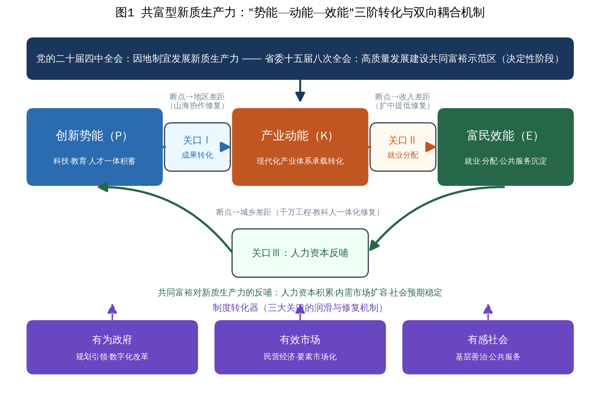

图1 共富型新质生产力：“势能—动能—效能”三阶转化与双向耦合机制

### （五）研究命题的提出

基于上述框架，本报告提出三个可检验的研究命题。命题P1（同向演进命题）：新质生产力发展指数（U1）与共同富裕指数（U2）总体同向上升，两系统耦合协调度（D）随时间呈持续上升态势，并依次经历“低水平耦合—磨合提升—高水平协调”的阶段跃迁。其机理在于双向赋能回路一经启动即具有自我强化性质，重大制度供给（如共同富裕示范区建设）将成为阶段跃迁的触发点。命题P2（关口修复命题）：转化关口修复机制越健全，耦合协调水平越高；三大关口同时获得制度性修复的区域，其D值等级跃升更快、更稳。其机理在于任一关口失灵都会截断能量传导，制度转化器的完备程度决定链条的整体通量。命题P3（多元组态命题）：共富型发展不存在单一必要条件，高共富绩效由创新投入、金融支持、人力资本、民营活力、城镇化等条件的多种组态等效驱动，存在多元等效的组态路径；而创新要素单兵突进、转化配套缺失的区域，将因关口失灵陷于非高绩效状态。其机理在于三阶转化是条件组合共同作用的系统过程，符合组态因果的殊途同归逻辑，这也为“因地制宜发展新质生产力”提供了理论注脚。命题P1、P2将主要通过指数测度与耦合协调分析检验，命题P3将通过全国省份样本的fsQCA组态分析检验，详见实证各章。

## 四、理论模型：“势能—动能—效能”三阶转化的数理刻画

第三章以质性语言构建了共富型新质生产力的三阶转化框架，本章进一步给出其数理表述。构建数理模型的目的有三：一是把“创新势能积蓄—产业动能转换—富民效能释放”的传导链条转写为可推导的方程系统，使三大转化关口的经济学含义获得参数化的精确界定；二是在统一模型中推演三大关口参数变动的比较静态与动态后果，从而为第三章提出的研究命题P1、P2、P3提供数理基础；三是刻画新质生产力系统与共同富裕系统双向赋能的耦合动力学，说明“高水平协同均衡”与“创新孤岛式低水平均衡”分化的参数条件，为实证章的耦合协调测度与组态分析提供理论预期。模型在罗默式内生增长框架〔R:romer〕与卢卡斯人力资本框架〔R:lucas〕的基础上进行扩展，将三大转化关口作为楔子（wedge）嵌入“知识生产—产出形成—收入分配—人力资本再生产”的完整循环，其建模思路亦借鉴了技能偏向型技术进步文献〔R:acemoglu,autor〕关于技术变迁分配效应的处理方式。

### （一）模型环境与基本设定

考虑一个连续时间的省域经济，由创新部门与最终品生产部门构成，劳动力分为城镇劳动者与农村劳动者两类。经济的总量生产函数采用扩展的柯布—道格拉斯形式：

Y(t)＝Aₑ(t)^σ·K(t)^α·[h(t)L(t)]^(1−α)　（1）

其中，Y(t)为总产出，K(t)为物质资本，L(t)为就业总量，h(t)为平均人力资本水平，Aₑ(t)为进入现实生产过程的有效技术存量，σ>0度量技术对产出的弹性，α∈(0,1)为资本产出弹性。式(1)的关键设定在于区分“知识存量”与“有效技术”：知识存量A(t)是创新部门积蓄的全部创新势能，但只有跨越成果转化关的部分才能落入生产函数，故定义

Aₑ(t)＝θ₁·A(t)，θ₁∈(0,1]　（2）

θ₁即成果转化关（关口Ⅰ）的转化效率参数：θ₁越接近1，表明中试熟化、风险资本、应用场景等转化条件越完备，创新势能滞留于“孤岛”的比例越低。知识存量的积累由研发投入驱动：

dA(t)/dt＝δ·sR·θ₀·A(t)　（3）

其中sR为全社会研发投入率（对应R&D经费投入强度），δ为知识生产率参数，θ₀∈(0,1]为基础研究组织效率。式(3)采用知识生产对既有存量线性的罗默式设定〔R:romer〕，意味着知识增速g_A＝δ·sR·θ₀由投入率与组织效率内生决定；教育科技人才一体化改革所改进的正是δ与θ₀，研发投入强度的提升所改进的是sR。

### （二）三大转化关口的参数化与增长—分配后果

1．成果转化关（关口Ⅰ）与增长。将式(2)(3)代入式(1)，沿平衡增长路径（资本产出比不变、就业增速为n、人力资本增速为γ_h），可得人均产出稳态增速：

g*＝σ/(1−α)·δ·sR·θ₀＋γ_h　（4）

同时，θ₁以水平效应进入产出：∂lnY/∂lnθ₁＝σ>0。由此得到两点含义：其一，长期增速由研发投入率、知识生产组织效率与人力资本增速共同决定；其二，成果转化效率θ₁的提升虽不改变稳态增速，但产生持久的水平效应，并在θ₁跃升后的转型期内形成一段增长加速窗口。这正是“创新孤岛”现象的数理表述——若θ₁低下，则即便A(t)高速积累，有效技术Aₑ(t)与现实产出仍可能增长乏力，创新势能无法转化为产业动能。

2．就业分配关（关口Ⅱ）与居民收入。设劳动报酬占产出份额为λ，其大小取决于产业体系的就业包容度与分配制度的完善程度，记为λ(θ₂)，λ′(θ₂)>0，θ₂∈(0,1]为就业分配关的传导效率参数：

w(t)L(t)＝λ(θ₂)·Y(t)　（5）

居民人均可支配收入由劳动报酬与转移净收入构成：

y(t)＝λ(θ₂)·Y(t)/L(t)＋τ(t)　（6）

对式(6)取对数并对时间求导（忽略转移项的短期波动），得居民收入增速与经济增速的关系：

γ_y−g*＝dlnλ(θ₂)/dt　（7）

式(7)给出“两个同步”的模型判据：当且仅当劳动报酬份额不随技术进步而下滑（dlnλ/dt≥0），居民收入增长才能与经济增长同步。若智能化改造对劳动的替代效应压低λ，则出现γ_y<g*的“增长不增收”，此即关口Ⅱ失灵的数理表述；θ₂的制度含义（促进高质量充分就业、扩大中等收入群体、健全要素参与分配机制）正是保证λ稳中有升的政策安排。

3．人力资本反哺关（关口Ⅲ）与城乡差距动态。设城镇、农村劳动者人力资本分别为hᵤ与hᵣ，技能偏向型技术进步使工资比呈现：

wᵤ/wᵣ＝(hᵤ/hᵣ)^ε，ε>1　（8）

其中ε为技能溢价弹性，ε>1刻画新技术对高技能劳动的偏向〔R:acemoglu〕。农村人力资本的积累依赖基本公共服务投入：

dhᵣ(t)/dt＝ψ·θ₃·qG·Y(t)/L(t)·hᵣ(t)^(1−ν)　（9）

其中qG为公共服务投入占产出比重，ψ为人力资本生产效率，ν∈(0,1)刻画积累的边际递减，θ₃∈(0,1]为人力资本反哺关的效率参数——教育医疗等公共服务在城乡间配置越均等、可及性越高，θ₃越大。定义城乡收入倍差B(t)＝yᵤ(t)/yᵣ(t)，结合式(8)(9)，其动态方程为：

dlnB(t)/dt＝ε·(γᵤ−ψ·θ₃·qG)　（10）

其中γᵤ为城镇人力资本增速。令式(10)等于零，得倍差收敛的阈值条件：

θ̃₃＝γᵤ/(ψ·qG)　（11）

当θ₃>θ̃₃时dB/dt<0，城乡倍差持续收敛；当θ₃<θ̃₃时，技能溢价机制将放大初始差距，倍差发散并通过子代人力资本代际传递而固化。式(10)(11)表明：在技能偏向型技术进步背景下，城乡差距的走向并非由技术本身决定，而是由公共服务均等化的制度参数θ₃决定——这为“千万工程”、教共体、基本公共服务一体化等浙江实践提供了严格的理论定位。

### （三）双系统耦合的动态演化与均衡分析

将上述结构性机制压缩为两个系统综合水平的交互动态。设U1(t)、U2(t)分别为新质生产力系统与共同富裕系统的综合发展水平（与实证章的指数测度对应），采用带交互项的逻辑斯蒂增长方程刻画其协同演化〔R:lv〕：

dU1/dt＝r₁·U1·(1−U1＋η₁·U2)　（12）

dU2/dt＝r₂·U2·(1−U2＋η₂·U1)　（13）

其中r₁、r₂>0为两系统的自我发展速率；η₂≥0为新质生产力对共同富裕的赋能强度，由关口Ⅰ、关口Ⅱ的参数决定，η₂＝η₂(θ₁,θ₂)且对两者均递增；η₁≥0为共同富裕对新质生产力的反哺强度，由关口Ⅲ的参数决定，η₁＝η₁(θ₃)且递增。1为各系统以自身要素所能达到的潜在容量基准，交互项η₁U2与η₂U1表示对方系统的发展对本系统容量边界的扩张效应。

联立dU1/dt＝0与dU2/dt＝0的非平凡解，得系统的正均衡：

U1*＝(1＋η₁)/(1−η₁·η₂)，U2*＝(1＋η₂)/(1−η₁·η₂)　（14）

在η₁·η₂<1条件下，均衡点的雅可比矩阵两特征根均为负，正均衡局部渐近稳定。式(14)蕴含三点性质。第一，∂U1*/∂η₁>0、∂U1*/∂η₂>0且对U2*对称成立：任一方向赋能强度的提高都会同时抬升两个系统的均衡水平，且由于分母1−η₁η₂的放大作用，双向赋能的合成效应大于两个单向效应之和——这构成“双向赋能优于单向赋能”的数理表述。第二，当η₁→0（反哺链路断裂）时，U1*退化为1、U2*退化为1＋η₂：共同富裕仍可被生产力单向拉动，但新质生产力将失去人力资本积累、内需扩容与预期稳定的反哺，锁定在自身容量边界上，系统整体停留在较低的均衡组合，这正是相位图（图2）左幅所示的低水平均衡情形。第三，均衡水平对(η₁,η₂)的联合弹性随η₁η₂上升而增大，意味着当两条赋能链路同时接近畅通时，系统呈现加速上升的“双螺旋”特征——这与实证章观察到的2021年以后耦合协调度逐级跃升的经验事实相互印证。

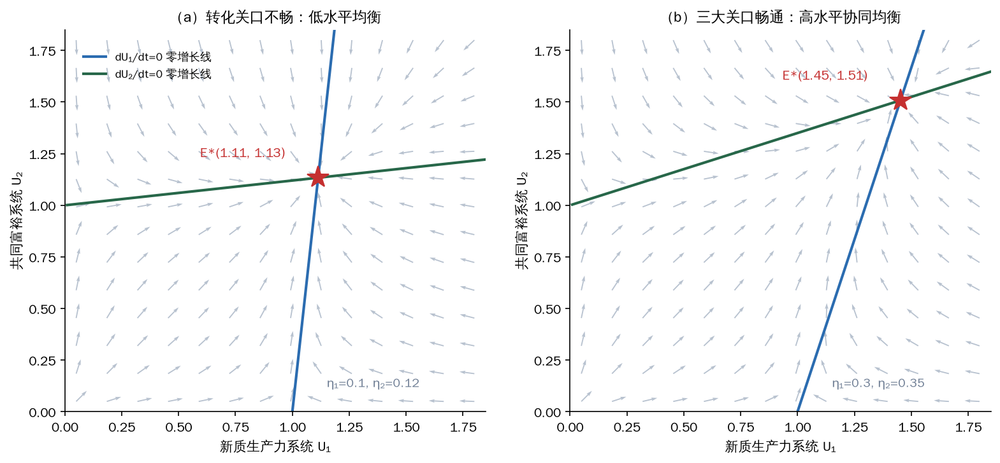

图2 双系统耦合演化的相位图：低水平均衡与高水平协同均衡

注：左、右两幅分别对应赋能强度较低（η₁＝0.10、η₂＝0.12）与较高（η₁＝0.30、η₂＝0.35）的参数情形；蓝、绿实线分别为dU1/dt＝0与dU2/dt＝0的零增长线，星号为正均衡点，箭头为系统演化的方向场。依据式(12)—(14)绘制。

进一步将耦合协调度指标嵌入模型。实证章使用的耦合协调度D＝√(C·T)沿系统轨道单调映射于(U1,U2)：在(12)(13)的稳定轨道上，U1与U2同向上升且差距有界，耦合度C保持高位，协调指数T随两系统水平提高而上升，故D沿轨道递增并收敛于均衡对应的水平D*。由此，θ参数—η强度—均衡水平—协调度四者形成完整的传导链：三大转化关口的制度参数决定赋能强度，赋能强度决定均衡位置，均衡位置决定耦合协调度的可达上限。

### （四）模型命题及其与实证检验的对应

综合上述推导，模型给出如下可检验命题。

命题M1（同向演进）：在η₁η₂<1且η₁、η₂>0的参数域内，从任意正初值出发，(U1,U2)沿稳定轨道同向上升并收敛于正均衡，耦合协调度D沿轨道单调上升。该命题对应第三章命题P1，其检验落在实证Ⅱ章的时序分析——若浙江样本期内D持续上升并呈阶段跃迁，则与命题预期一致。

命题M2（关口决定）：均衡水平(U1*,U2*)与协调度上限D*是θ₁、θ₂、θ₃的递增函数；任一关口参数趋于零都会显著压低均衡水平并使系统偏向单向依赖结构。该命题对应命题P2，其检验有二：时序上，重大关口修复性制度供给（如共同富裕示范区建设对θ₂、θ₃的系统性改进）应对应D的加速跃升；截面上，关口配套缺失的地区应稳定落入低绩效集合。

命题M3（组态等效与非对称）：由η₂＝η₂(θ₁,θ₂)的复合结构可知，不同的(θ₁,θ₂,θ₃)组合可以生成相同的赋能强度与相近的均衡水平，故高水平协同不存在唯一的参数路径；反之，θ₁较高而θ₂、θ₃低下的组合（创新孤岛型参数结构）无法达到高均衡，且其失败机理与低θ₁组合并不对称。该命题对应命题P3，直接构成实证Ⅲ章fsQCA组态分析的理论预期。

需要说明模型的三点简化及其影响。其一，模型未显式刻画空间维度，地区差距被吸收进θ₁的空间含义（创新势能的跨区域转化）之中，山海协作等空间传导机制可理解为对区域间θ₁差异的制度性平抑；其二，λ(θ₂)与η函数未给出显式函数形式，这不影响比较静态结论的方向，但意味着模型只提供定性预期而非数值预测；其三，双系统方程(12)(13)是对多重结构机制的降维概括，其参数η₁、η₂应理解为制度综合体的约简表达。上述简化决定了模型的恰当使用方式：为实证分析提供机制假说与解释框架，而非替代实证检验本身。

---

## 五、浙江统筹新质生产力发展与共同富裕示范的探索历程与典型化事实

党的二十届四中全会通过的《建议》提出“因地制宜发展新质生产力”，并将“人民生活品质不断提高”列为“十五五”时期主要目标，要求“推动人的全面发展、全体人民共同富裕迈出坚实步伐”。2021年6月，中共中央、国务院印发《关于支持浙江高质量发展建设共同富裕示范区的意见》，浙江成为全国唯一的共同富裕示范区；省委十五届八次全会及其《建议》起草说明进一步阐明，“十五五”时期是浙江持续夯实基础、全面发力、突破提升、高质量发展建设共同富裕示范区的决定性阶段，总目标是“高质量发展建设共同富裕示范区取得决定性进展，率先呈现基本实现社会主义现代化的生动图景”。本章以“势能—动能—效能”三阶转化框架为分析透镜，系统回溯浙江统筹新质生产力发展与共同富裕示范建设的探索历程，从创新势能积蓄、产业动能转换、富民效能释放三个维度考察其实践图景，并提炼若干典型化事实，为后续实证测度提供经验基础。

### （一）历程回顾：从“八八战略”到“十五五”决定性阶段的四期演进

浙江统筹生产力跃迁与共同富裕的探索并非始于示范区获批，而是一个跨越二十余年、制度供给不断加密的连续过程。以标志性部署为界，可划分为四个阶段，其演进逻辑恰与“势能—动能—效能”三阶转化链条的逐级贯通相对应。

1．奠基期（2003—2012年）。2003年，“八八战略”作出发挥八个方面优势、推进八个方面举措的系统部署，为此后二十余年发展确立了总纲领；同年6月，习近平同志亲自部署“千村示范、万村整治”工程，开启城乡融合的先手棋〔R:huangzuhui〕；更早的2002年，山海协作工程启动，构建起发达地区与山区县的跨空间要素对流通道。这一时期的制度安排看似分散，实则为后来三大转化关口——成果转化关、就业分配关、人力资本反哺关——的修复预置了机制原型。

2．转型期（2013—2020年）。浙江以数字化为主线推动动能转换与治理变革：2016年底启动“最多跑一次”改革并于2018年写入国务院政府工作报告；2017年将数字经济确立为“一号工程”，数字经济核心产业增加值占GDP比重由2015年的7.9%持续攀升。这一阶段的关键在于把先发的市场化优势转化为数字时代的产业动能，为势能向动能的转化搭建了产业载体。

3．示范期（2021—2025年）。2021年中央《意见》赋予浙江共同富裕示范区使命，同年2月数字化改革以“1+5+2”体系整体推进；2023年部署数字经济创新提质、营商环境优化提升、“地瓜经济”提能升级三个“一号工程”，并以政务服务增值化改革打造营商环境“一号改革工程”。这一阶段的鲜明特征是把“富民效能”从增长的附属结果提升为制度设计的直接目标，扩中提低、低保市域同标等分配侧改革密集落地。

4．跃升期（2026年起）。自2024年底省委经济工作会议部署、2025年1月实施方案出台，到2025年7月省委十五届七次全会通过《关于加快建设创新浙江因地制宜发展新质生产力的决定》，“创新浙江”成为新阶段总抓手；2025年11月省委十五届八次全会通过浙江“十五五”建议，2026年1月省十四届人大四次会议通过“十五五”规划纲要，明确把缩小城乡差距、地区差距、收入差距作为主攻方向，围绕“富民”统筹推进“强城”“兴村”“融合”三篇文章。至此，创新势能、产业动能与富民效能的统筹进入一体设计、闭环运行的新阶段。

### （二）创新势能积蓄：教育科技人才一体化的浙江答卷

创新势能是共富型新质生产力的源头蓄积。省委十五届七次全会明确“坚持教育科技人才一体改革发展为主要支撑、科技创新和产业创新深度融合为关键路径、人工智能为核心变量”，浙江的势能积蓄呈现投入、平台、主体、制度四个层面的递进逻辑。

一是研发投入强度持续攀升并拉大对全国的领先幅度。据历年《浙江省国民经济和社会发展统计公报》与《全国科技经费投入统计公报》〔R:zjtjgb,kjjfgb〕，浙江R&D经费投入强度由2015年的2.33%升至2024年的3.22%，同期全国平均由2.07%升至2.69%，领先幅度由0.26个百分点扩大至0.53个百分点；2024年全省R&D经费达2901.4亿元，居全国第4位，区域创新能力至“十四五”末稳居全国第4。如图3所示，浙江研发投入曲线始终运行于全国平均线之上，且呈“加速上翘”形态。

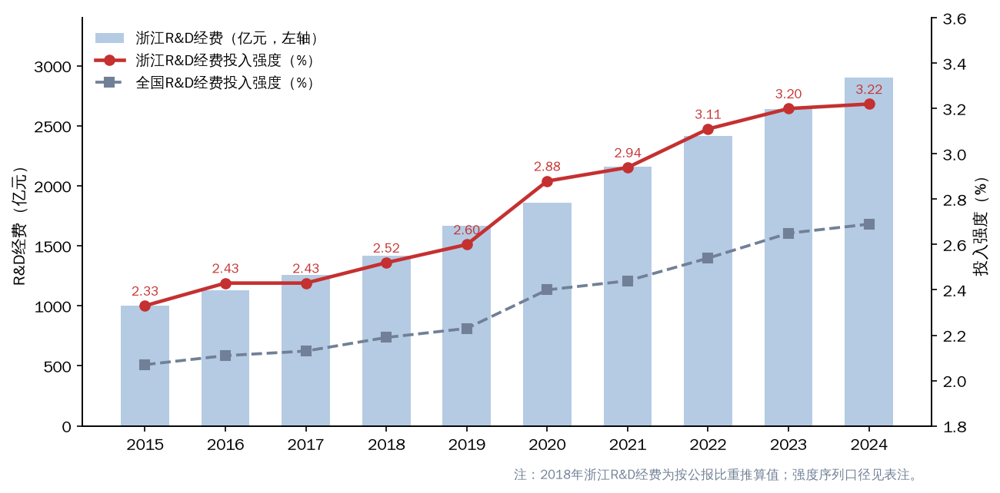

图3 2015—2024年浙江省R&D经费及投入强度（与全国比较）

注：2018年浙江R&D经费为按当年统计公报公布比重推算值，投入强度序列口径详见附录说明；数据来源为历年《浙江省国民经济和社会发展统计公报》《全国科技经费投入统计公报》。

二是战略科技力量体系化布局。全省建成之江、湖畔、良渚、西湖、瓯江、甬江、天目山、白马湖、东海、湘湖10家省实验室，其中7家布局杭州；之江实验室2017年9月由省政府、浙江大学与阿里巴巴共建成立，西湖大学2018年成立、系全国第一所社会力量举办且国家重点支持的新型研究型大学；杭州城西科创大走廊2016年启动，形成紫金港、未来、青山湖三大科技城联动格局。

三是创新主体量质齐升。高新技术企业由2015年的7905家增至2024年的4.75万家左右，科技型中小企业2024年累计达13.1万家，创新主体的金字塔式扩张为势能沉淀提供了微观基础。

四是教科人一体化的制度供给持续加密〔R:miaoyang〕。省委十五届八次全会部署实施“双一流196”工程、“135”人才强省体系建设工程，支持浙江大学加快迈向世界一流大学前列、西湖大学建设世界一流新型研究型大学，深化“校（院）企双聘”，完善“科技副总”“产业教授”机制；创新浙江建设明确2027年R&D强度3.4%以上、全国重点实验室27家以上、每万人高价值发明专利25件、技术交易总额5300亿元以上的量化锚点。

创新势能积蓄的微观表征，集中体现于2025年引发全国关注的杭州“六小龙”现象。深度求索（DeepSeek）2023年成立，其2025年1月发布的R1模型性能比肩OpenAI o1并登顶中美应用商店免费榜；宇树科技2016年创立，2024年机器狗全球市场占有率约70%、人形机器人交付超1500台、营收超10亿元；游戏科学的《黑神话：悟空》2024年8月发售3天销量即超1000万套，至2025年1月约2800万套、销售额约90亿元；强脑科技2018年落户杭州、系非侵入式脑机接口头部企业；群核科技2026年4月在港交所上市、成为“六小龙”首家上市企业；云深处科技2017年依托浙江大学创立，其四足机器人实现全国第一家变电站全自主巡检。“六小龙”均为民营科技企业，其涌现并非单点偶然，而是研发投入、平台体系、人才生态与场景开放长期耦合的必然产物，直观展示了浙江成果转化关的相对畅通——创新势能没有滞留于实验室，而是快速落入产业体系。

### （三）产业动能转换：数字经济引领与现代化产业体系构建

产业动能是创新势能的产业化形态，其强弱直接决定势能能否避免“创新孤岛”化。从总量看，据历年统计公报，浙江地区生产总值由2015年的42886亿元增至2024年的90131亿元、2025年达94545亿元（增长5.5%），除2020年、2022年受疫情冲击外各年增速均保持在5.5%以上；2024年人均GDP达135565元（折19035美元），全员劳动生产率由2020年的16.6万元/人提高到2024年的22.9万元/人，表明增长的驱动结构正由要素投入转向效率提升，如图4所示。

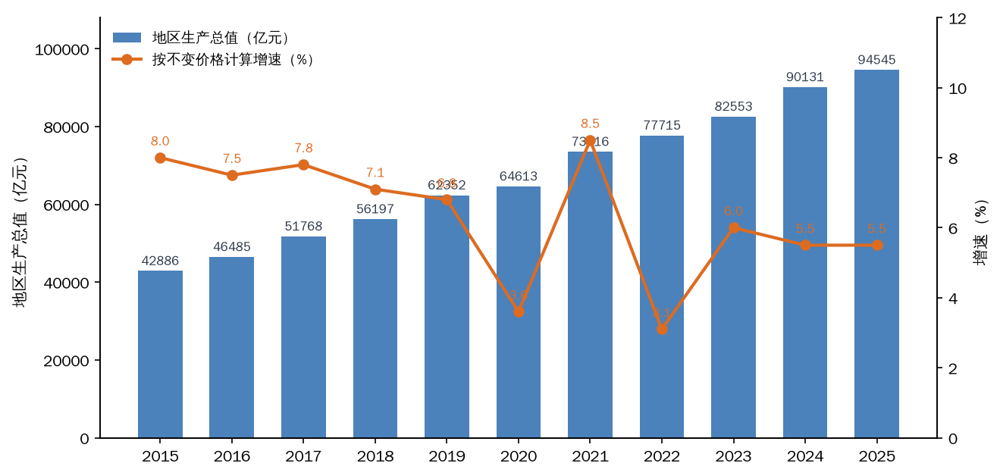

图4 2015—2025年浙江省地区生产总值及增速

注：数据来源为历年《浙江省国民经济和社会发展统计公报》。

一是数字经济从“一号工程”跃升为万亿级核心产业。自2003年“数字浙江”部署、2017年数字经济“一号工程”到2023年数字经济创新提质“一号发展工程”，浙江数字经济核心产业增加值由2015年的3373亿元（占GDP7.9%）增至2024年的11060亿元（占GDP12.3%），实现总量破万亿；同期全国数字经济核心产业增加值占GDP比重为10.5%（2024年），浙江领先1.8个百分点；广义口径下2023年全省数字经济增加值4.33万亿元、占GDP比重52.5%，2027年目标为数字经济增加值7万亿元、核心产业增加值1.6万亿元。如图5所示，核心产业增加值及占比呈现“双升”轨迹。

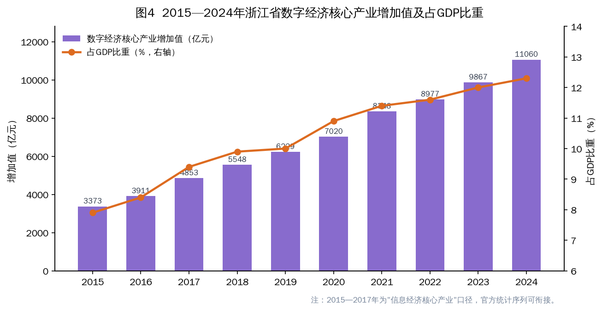

图5 2015—2024年浙江省数字经济核心产业增加值及占GDP比重

注：2015—2017年为“信息经济核心产业”口径，官方统计序列可衔接；数据来源为历年《浙江省国民经济和社会发展统计公报》。

二是“人工智能+”成为动能转换的核心变量。省委十五届七次全会提出“人工智能将成为创新浙江的最鲜明标识、最核心支撑”；《浙江省“人工智能+”行动计划（2024—2027年）》明确2027年培育10个以上全国一流垂直行业大模型、500个以上标杆应用场景；2025年1—11月全省规模以上人工智能核心产业营业收入6294亿元、增长21.6%，2025年底建成投用总算力超156EFLOPS；省委十五届八次全会进一步锚定全省规上人工智能核心产业营业收入1.2万亿元的目标。

三是“415X”集群与制造业智能化重塑产业体系骨架。按照“415X”先进制造业集群培育工程，浙江构建4个万亿级世界级产业群、15个千亿级特色产业集群和若干百亿级“新星”产业群的梯度体系；累计培育省级“未来工厂”93家（2025年1月，杭州23家居首），拥有犀牛智造、隆基绿能嘉兴、三门核电3家全球“灯塔工厂”；2024年装备制造业、高新技术产业、高技术制造业增加值占规上工业比重分别达48.9%、69.0%、17.2%，国家级专精特新“小巨人”企业1807家、居全国第三，制造业单项冠军278家、居全国第一（2025年12月第九批发布后），其中宁波104家、连续7年居全国城市首位。

四是民营经济构成动能转换与就业吸纳的主体力量。2024年民营经济增加值占GDP的67.4%，规上工业民营企业5.5万家、占比92.7%，增加值占比72.4%，民营企业进出口占全省的80.8%；全省在册经营主体1095.17万户、其中民营企业380.77万户，中国民营企业500强入围107家（2025年）、连续27年居全国第一。民营经济点多面广、根植县域的组织形态，使产业动能天然携带较高的就业包容度，这正是动能顺畅通过就业分配关传导为居民收入的结构性前提。

### （四）富民效能释放：千万工程、山海协作与扩中提低的系统集成

富民效能是三阶转化的落脚点，也是检验新质生产力“共富成色”的最终标尺。从总量指标看，浙江居民人均可支配收入由2015年的35537元增至2024年的67013元、2025年达70240元并首破7万元；农村居民人均可支配收入由21125元增至2024年的42786元、2025年的45154元，连续40年居全国省区第一，城镇居民收入连续24年居全国省区第一；城乡居民收入倍差由2015年的2.07持续收敛至2024年的1.83、2025年的1.81，而同期全国倍差为2.34（2024年）。如图6所示，浙江呈现“收入水平上台阶、城乡倍差下台阶”的剪刀差形态，这在全国范围内具有稀缺性。

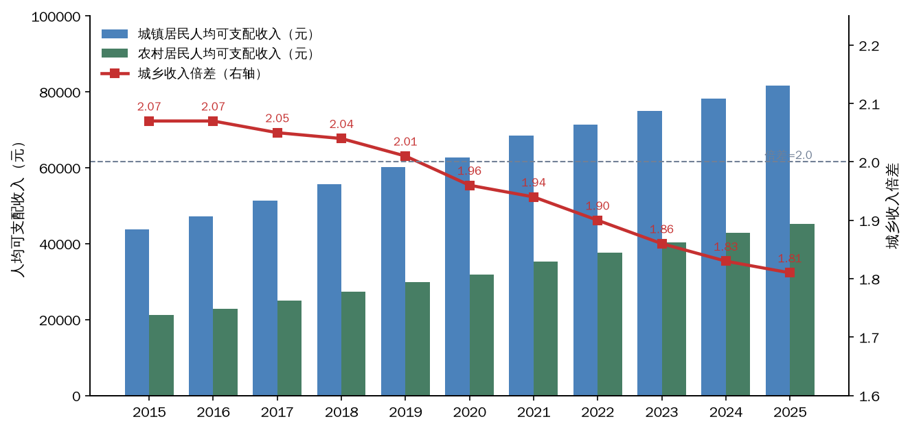

图6 2015—2025年浙江省城乡居民收入及倍差变化

注：数据来源为历年《浙江省国民经济和社会发展统计公报》。

一是以“千万工程”牵引城乡分配结构优化，修复就业分配关的城乡断点。“千万工程”自2003年6月部署以来，2018年获联合国“地球卫士奖”，90%以上村庄达到新时代美丽乡村标准，农村居民收入从2003年的5431元增至2023年的40311元，城乡倍差从2003年的2.43缩小至2024年的1.83。在其牵引下，强村富民机制持续深化：至2025年全省强村公司达2278家、参股行政村11280个、年利润21.7亿元、村均分红15.4万元；226个省级重点村片区带动1447个村组团发展；2024年集体经济经营性收入50万元以上行政村占比达60%。集体经济的组织化增收，使产业动能得以通过财产性、经营性收入渠道向农民传导。

二是以山海协作修复成果转化关的空间断点，遏制地区差距扩大。山海协作工程实施20年来，山区26县累计获援助资金近1000亿元、落地产业合作项目12438个、投资7305亿元；签约共建“产业飞地”18个，“消薄飞地”30个实现26县全覆盖、累计返利超2亿元，丽水共建科创飞地30块；“1+1+1+1”新型结对机制下，50个经济强县结对26县，仅2023年合作项目225个、到位资金320亿元。其成效体现为：2023年山区26县GDP全部超百亿元、平均增速高于全省1个百分点，居民收入与全省平均之比达0.745；2024年8月，山区26县动态调整为“山区23县+2海岛县”，并力争2027年山区海岛县减至20个以下。

三是以扩中提低改革直接作用于收入分配的两端。浙江在全国率先划定中等收入群体线（家庭年收入10万元），2021年家庭年可支配收入10万—50万元群体比例达72.4%、较2016年提高24.3个百分点；“提低”端呈现清晰的增速梯度：低收入农户人均可支配收入由2021年的16491元增至2023年的21440元（增长13.4%、首破2万元）、2024年的23830元（增长11.1%）、2025年的26439元（增长10.9%），山区26县低收入农户2023年达19730元（增长13.9%）、山区海岛县口径2024年达22021元（增长11.5%），连续保持两位数增长且显著快于全省居民收入平均增速，形成“低收入农户快于农村居民、农村快于城镇”的包容性增长梯度，如图7所示。

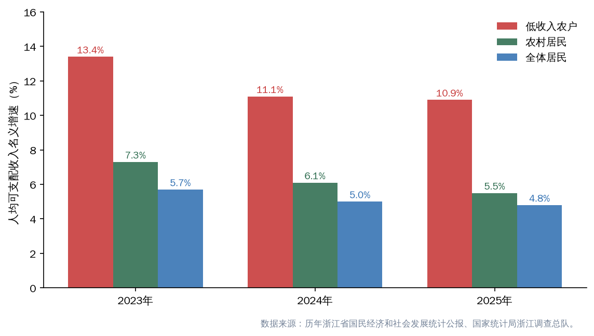

图7 浙江省居民收入增速的“提低”梯度（2023—2025年）

注：数据来源为历年《浙江省国民经济和社会发展统计公报》及国家统计局浙江调查总队发布数据。

四是以公共服务一体化夯实人力资本反哺关。2022年12月浙江在全国率先实现低保标准市域同标（11市均超1000元/月、平均1083元/月）；城乡义务教育共同体覆盖所有乡村学校，舟山、淳安、龙游、景宁“一市三县”开展基本公共服务一体化试点；民生支出占一般公共预算支出比重2023年、2024年分别达75.5%、76.4%；“十四五”期间城镇新增就业累计565.13万人（至2025年9月），基本养老保险参保4757.71万人，2024年末户籍人口人均预期寿命82.55岁、居全国省区第一。公共服务的均等化供给，正是效能回流为人力资本、支撑势能再积蓄的制度通道。

从空间格局看，富民效能的释放呈现罕见的均衡性。如图8所示，2024年全省11个设区市居民人均可支配收入全部超过全国平均水平，系全国唯一；居民收入低于全国平均的县（区）由8个降为4个；设区市居民收入最高最低倍差仅1.54（杭州76777元、丽水50015元）；嘉兴（1.51）、舟山（1.52）、湖州（1.53）等市城乡倍差已降至1.55以下，创新高地杭州的倍差亦仅为1.64；而GDP增速居前五位的恰是丽水（6.6%）、绍兴（6.5%）、衢州（6.4%）与温州、金华（均6.3%），山区县增速领跑全省，后发地区呈现实质性追赶态势。

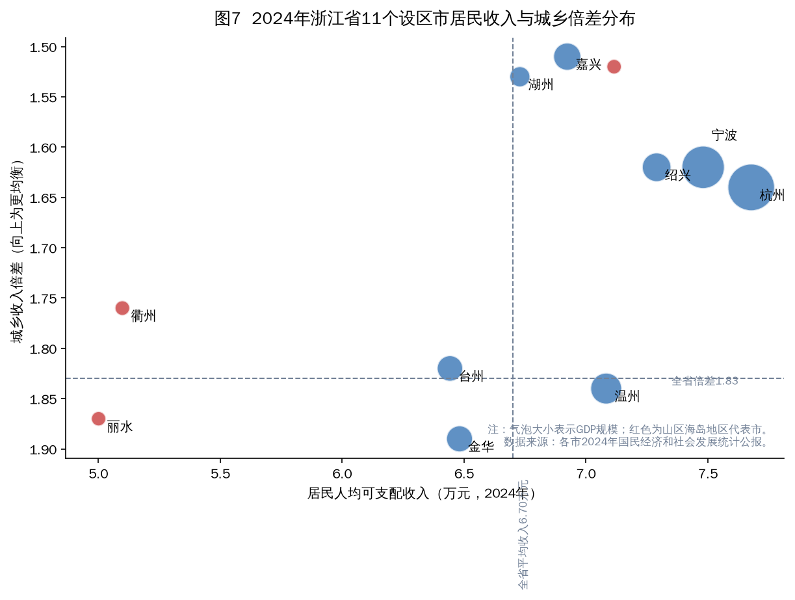

图8 2024年浙江省11个设区市居民收入与城乡倍差分布

注：气泡大小表示地区生产总值规模，红色为山区海岛地区代表市；数据来源为各市2024年国民经济和社会发展统计公报。

### （五）典型化事实：五个有待实证检验的经验命题

综合上述考察，浙江实践呈现出五个典型化事实，它们共同构成“共富型新质生产力”的经验雏形，也为实证部分提出了待检验的命题。

典型化事实一：增长跃升与差距收敛同步实现。2015—2025年，全省GDP由42886亿元增至94545亿元，同期城乡收入倍差由2.07降至1.81，“做大蛋糕”与“分好蛋糕”未呈现理论上担忧的此消彼长关系，“创新极化—均衡共享”悖论在省域尺度上未被观察到。

典型化事实二：创新投入强度提升与分配结构改善同向而行。R&D投入强度由2.33%升至3.22%的十年，恰是倍差由2.07收敛至1.83的十年；且创新要素最密集的杭州，其城乡倍差（1.64）反而低于全省平均，表明创新极化并未自动转化为分配极化，其间存在制度性转化机制。

典型化事实三：农村居民收入连续40年居全国省区第一，且低收入群体增速持续领跑，增长呈现自下而上的包容性梯度，就业分配关的传导相对畅通。

典型化事实四：后发地区实现“总量突破+增速领跑”的双重追赶，山区26县GDP全部超百亿且增速高于全省1个百分点，成果转化关的空间断点在山海协作机制下得到显著修复。

典型化事实五：在全国“富裕度—共享度”坐标系中，浙江占据独特生态位。如图9所示，以2024年居民人均可支配收入表征富裕度、以城乡收入倍差逆向表征共享度，31个省份呈现明显的梯度分化：浙江居民收入（67013元）仅次于上海（88366元）、北京（85415元）两个直辖市，而其倍差（1.83）低于上海、江苏（均2.04）、山东（2.14）、广东（2.31）、北京（2.32）等所有经济大省（市），处于“高富裕—高共享”象限的前沿位置，“富而不均”与“均而不富”的两难在浙江被同时突破。

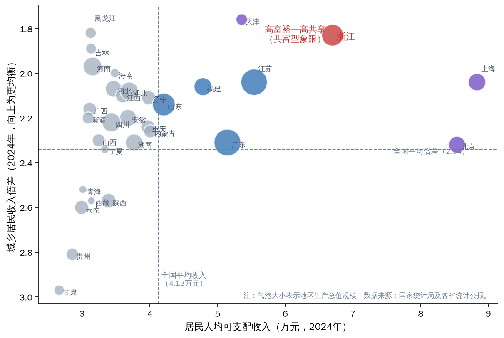

图9 31个省份“富裕度—共享度”分布格局（2024年）

注：气泡大小表示地区生产总值规模；数据来源为国家统计局及各省统计公报。

需要指出的是，上述典型化事实仍属描述性的经验观察，其背后的三个关键问题尚待系统检验：其一，新质生产力发展与共同富裕水平的同步提升是否具有统计意义上的稳健同向性；其二，两大系统之间是否形成了由失调走向协调的耦合演进，且演进节奏与示范区建设等制度供给的时序是否吻合；其三，浙江“创新引领、民营驱动、城乡融合”的要素组合，在全国省份的组态比较中是否构成通往高共富绩效的独特路径。这三个问题分别对应理论框架部分提出的三个研究命题，将在后续实证章节依托新质生产力发展指数（U1）、共同富裕指数（U2）、耦合协调度（D）测度与fsQCA组态分析逐一回答。

## 六、研究设计

党的二十届四中全会审议通过的《中共中央关于制定国民经济和社会发展第十五个五年规划的建议》，将“全要素生产率稳步提升”“居民收入增长和经济增长同步、劳动报酬提高和劳动生产率提高同步”等列入“十五五”时期的目标要求；省委十五届八次全会进一步提出到2030年全社会研发投入强度3.5%以上、居民人均可支配收入9万元左右、城乡居民收入和实际消费水平差距进一步缩小等量化目标。这表明，新质生产力发展与共同富裕推进均已进入可量化、可评估、可考核的阶段，科学测度两大系统的发展水平及其互动关系，是研究阐释全会精神、支撑“十五五”路径设计的基础性工作。本章依托理论框架部分提出的“共富型新质生产力”概念与“势能—动能—效能”三阶转化框架，构建新质生产力发展指数（U1）与共同富裕指数（U2）的评价指标体系，阐明熵值法、耦合协调度模型与模糊集定性比较分析（fsQCA）三种方法的技术细节与选择依据，并对数据来源、统计口径与稳健性安排作系统说明，为后续三章实证分析提供统一、透明、可复核的技术基础。

### （一）指标体系构建

1．构建原则。指标体系的科学性直接决定测度结果的可信度，本研究遵循四项原则。一是理论契合性。指标选取严格对应理论框架的维度设定：新质生产力发展指数覆盖“创新势能”与“产业动能”两个子系统，对应三阶转化链条的前两个环节；共同富裕指数覆盖“富裕度”与“共享度”两个子系统，前者刻画“做大蛋糕”的发展性维度，后者刻画“分好蛋糕”的共享性维度，共同承接“富民效能”的理论内涵。二是政策导向性。所选指标尽可能与中央和省委的显性政策锚点对接——研发投入强度、居民人均可支配收入、城乡居民收入倍差、常住人口城镇化率均为全会文件与共同富裕示范区建设方案中的标志性指标，从而保证测度结果能够直接对话“十五五”政策目标。三是数据可得性与口径可比性。全部指标采用历年统计公报等官方权威口径，保证2015—2024年十年时序序列完整无缺失；对存在口径调整的指标，如实披露并采用官方衔接序列。四是简约稳健性。在十年时序样本约束下，过多指标会稀释单指标信息含量并引入口径断点噪声，故坚持“少而精”，凝练为最能表征系统本质特征的核心指标，并对企业数量类指标取自然对数以消除量级差异对赋权的扭曲。

2．新质生产力发展指数（U1）指标体系。习近平总书记指出，新质生产力是“具有高科技、高效能、高质量特征，符合新发展理念的先进生产力质态”，且“科技创新是发展新质生产力的核心要素”。据此，创新势能子系统选取R&D经费投入强度与高新技术企业数（取自然对数）两项指标：前者表征全社会创新资源投入的相对强度，是“高科技”特征的投入侧表达，也是创新浙江建设的核心考核指标；后者表征创新主体的规模与厚度，反映创新势能在企业层面的组织化积蓄。产业动能子系统选取数字经济核心产业增加值占GDP比重与全员劳动生产率两项指标：前者刻画势能落入产业体系后形成的新动能结构，对应浙江数字经济先发优势的典型化事实；后者直接度量生产力的“高效能”特征，是全要素生产率在省域可测意义上的最优代理，亦为省委“十五五”建议明确的2030年量化目标之一。经熵值法客观赋权，各指标权重如表1所示。全员劳动生产率（0.3740）与R&D经费投入强度（0.2663）权重居前，表明样本期内二者的时序变异蕴含最大信息量，恰与新质生产力以全要素生产率大幅提升为核心标志的理论界定相互印证。

表1　浙江省新质生产力发展水平评价指标体系

| 子系统 | 指标 | 属性 | 熵值法权重 |
|---|---|---|---|
| 创新势能 | R&D经费投入强度（%） | + | 0.2663 |
| 创新势能 | 高新技术企业数（取自然对数） | + | 0.1232 |
| 产业动能 | 数字经济核心产业增加值占GDP比重（%） | + | 0.2364 |
| 产业动能 | 全员劳动生产率（万元/人） | + | 0.3740 |

3．共同富裕指数（U2）指标体系。“共同富裕是社会主义的本质要求，是中国式现代化的重要特征”，其测度必须同时兼顾“富裕”的总量维度与“共同”的分配维度。富裕度子系统选取居民人均可支配收入、人均地区生产总值与居民人均消费支出三项指标，分别从收入、产出与生活品质三个侧面刻画发展成果的总体水平；其中居民人均消费支出反映收入向实际生活品质的转化程度，呼应《建议》“居民消费率明显提高”的目标指向。共享度子系统选取城乡居民收入倍差（负向指标）、农村居民人均可支配收入与常住人口城镇化率三项指标：城乡倍差是“三大差距”中城乡差距与收入差距的交汇性表征，为唯一负向指标；农村居民人均可支配收入直接对应“提低”取向下短板群体的增收成效；常住人口城镇化率反映城乡融合的空间结构演进与公共服务可及性的改善。各指标权重如表2所示。居民人均消费支出（0.2513）与农村居民人均可支配收入（0.2465）权重较高，说明样本期内消费扩容与农民增收是共同富裕指数提升的主要信息来源；城乡倍差与城镇化率权重较低（各0.0520），系其年度变化相对平缓、信息熵较高所致，但二者作为“三大差距”与城乡融合的直接结构性表征，在指标体系中具有不可替代的理论地位。

表2　浙江省共同富裕水平评价指标体系

| 子系统 | 指标 | 属性 | 熵值法权重 |
|---|---|---|---|
| 富裕度 | 居民人均可支配收入（元） | + | 0.2166 |
| 富裕度 | 人均地区生产总值（元） | + | 0.1815 |
| 富裕度 | 居民人均消费支出（元） | + | 0.2513 |
| 共享度 | 城乡居民收入倍差 | − | 0.0520 |
| 共享度 | 农村居民人均可支配收入（元） | + | 0.2465 |
| 共享度 | 常住人口城镇化率（%） | + | 0.0520 |

### （二）研究方法

1．极值法标准化与熵值法赋权。设研究期为n年、某系统指标数为m项，xᵢⱼ为第i年第j项指标的原始值。由于各指标量纲与数量级不同，且存在正、负向属性差异，首先采用极值法进行标准化：

正向指标：x′ᵢⱼ＝(xᵢⱼ−minⱼ*)/(maxⱼ*−minⱼ*)；负向指标：x′ᵢⱼ＝(maxⱼ*−xᵢⱼ)/(maxⱼ*−minⱼ*)　（15）

式(15)中，maxⱼ*与minⱼ*为第j项指标经拓展后的上、下限，即在样本实际极大值基础上上浮10%、在实际极小值基础上下调10%取得。作此拓展的考量在于：传统极值法以样本实际极值为界，会使时序两端年份的标准化值恰为0或1——取0将导致后续信息熵计算中对数运算无定义，取1则人为夸大端点年份的相对位置，产生“端点效应”；对上下限各拓展10%后，所有标准化值落于(0,1)开区间内，既保留序列的相对结构，又保证熵值计算的数学可行性与端点年份取值的合理性。

在标准化基础上采用熵值法确定指标权重。熵值法依据指标时序变异所含信息量客观赋权，能够避免主观赋权的随意性。第j项指标的信息熵为：

eⱼ＝−(1/ln n)·Σᵢ(pᵢⱼ·ln pᵢⱼ)，其中pᵢⱼ＝x′ᵢⱼ/Σᵢ x′ᵢⱼ　（16）

信息熵越大，指标变异度越小、提供的信息量越少。据此定义差异系数并归一化得到权重：

gⱼ＝1−eⱼ，wⱼ＝gⱼ/Σⱼ gⱼ　（17）

各年度系统综合指数由标准化值与权重线性加权合成，即Uᵢ＝Σⱼ(wⱼ·x′ᵢⱼ)，由此分别得到历年新质生产力发展指数U1与共同富裕指数U2及其子系统指数。

2．耦合协调度模型。如理论框架部分所述，新质生产力与共同富裕之间存在“双向赋能”关系：新质生产力经三大转化关口向富民效能传导，共同富裕经人力资本积累、内需扩容与预期稳定反哺创新势能。这种双向、非线性的互动关系，恰是耦合协调度模型的适用情境——该模型源于物理学耦合理论〔R:wangshujia〕，用于刻画两个及以上系统通过各自要素相互作用、彼此影响的关联程度与协同水平。首先定义耦合度：

C＝2·√(U1·U2)/(U1＋U2)　（18）

C取值于[0,1]，值越大表明两系统关联互动越紧密。但耦合度存在固有局限：当两系统均处低水平时C仍可能接近1，形成“低水平伪协调”的误判。为此引入综合协调指数以反映两系统的整体发展水平：

T＝α·U1＋β·U2　（19）

其中α、β为待定权重。鉴于新质生产力是共同富裕的物质基础、共同富裕是新质生产力的价值归宿与反哺来源，两系统互为条件、同等重要，取α＝β＝0.5。在此基础上构建耦合协调度：

D＝√(C·T)　（20）

D取值于[0,1]，兼顾“关联紧密程度”与“发展水平高低”双重信息，D值越大表明两系统协调发展水平越高。参照学界通行标准，将耦合协调度划分为十个等级，如表3所示。

表3　耦合协调度等级划分标准

| 耦合协调度D | 协调等级 | 耦合协调度D | 协调等级 |
|---|---|---|---|
| [0, 0.1) | 极度失调 | [0.5, 0.6) | 勉强协调 |
| [0.1, 0.2) | 严重失调 | [0.6, 0.7) | 初级协调 |
| [0.2, 0.3) | 中度失调 | [0.7, 0.8) | 中级协调 |
| [0.3, 0.4) | 轻度失调 | [0.8, 0.9) | 良好协调 |
| [0.4, 0.5) | 濒临失调 | [0.9, 1.0] | 优质协调 |

需要说明的是，实证章将同时报告C、T、D三个量值：C反映两系统“是否同频”，T反映两系统“水平几何”，D综合二者刻画协调发展的总体态势。三者分开解读，可以辨识耦合协调度提升的结构性来源，避免以单一指标掩盖系统演化的内在细节。

3．fsQCA方法及其选择依据。为在全国坐标系中识别共富型新质生产力发展的多元实现路径，本研究以31个省（自治区、直辖市）为案例开展模糊集定性比较分析〔R:chenjin,wangfushi〕。选择该方法主要基于方法论与研究情境的双重考量。一方面，从方法论适配性看，fsQCA以集合论与布尔代数为基础，将案例视为条件的组态，能够识别多重前因条件经由“联动匹配、多重并发”产生结果的复杂因果关系，兼容“殊途同归”的等效性特征与“因果非对称”特征〔R:duyunzhou2020〕——即导致高绩效与非高绩效的条件组合并非互为镜像，从而克服传统回归分析聚焦单一变量净效应、隐含因果对称假设的局限；同时，fsQCA在中小样本条件下具有独特优势，31个省级案例与5个前因条件的配置符合该方法关于样本量与条件数适配的通行要求，能够兼顾案例分析的深度与跨案例比较的广度。另一方面，从研究情境适配性看，共同富裕取向的发展绩效并非某一要素单兵突进的线性结果，而是创新投入、数字金融、人力资本、民营经济、城镇化等多重条件相互依存、协同联动的系统性产物；理论框架部分提出的命题P3明确预设“共富型发展存在多元等效组态路径”，而各省份资源禀赋与发展阶段差异悬殊，《建议》“因地制宜发展新质生产力”的要求在方法论上恰恰对应组态思维而非唯一“最优解”思维。fsQCA能够识别通往高共富绩效的多条等效路径，并定位浙江所属的组态类型，为评估浙江路径的独特性与可推广性提供全国参照。具体设定上，结果变量为共富绩效指数，由居民人均可支配收入与城乡居民收入倍差（逆向）经熵值法合成；条件变量为创新投入强度、数字普惠金融、人力资本水平、民营经济活力与城镇化水平五项；校准采用直接校准法，以样本95%、50%、5%分位数分别作为完全隶属、交叉点与完全不隶属的锚点〔R:ragin〕，对校准后隶属度恰为0.5的案例调整为0.501以避免案例信息丢失。变量测量、校准锚点与阈值设定的完整细节详见实证章。

4．障碍度模型、相对发展度与灰色关联分析。为深化测度结果的结构性解读并考察其稳健性，本研究引入三类辅助分析工具。其一，障碍度模型用于识别制约系统水平提升的关键短板。第i年第j项指标的障碍度定义为：

Oᵢⱼ＝wⱼ·(1−x′ᵢⱼ)/Σⱼ[wⱼ·(1−x′ᵢⱼ)]×100%　（21）

其中(1−x′ᵢⱼ)为指标偏离度，度量该指标与理想水平的差距。障碍度兼顾指标的权重地位与现实差距，数值越大表明该指标对系统水平提升的制约越强，可为政策靶点的识别提供指标级证据。其二，相对发展度用于判别两大系统孰快孰慢的同步性形态：

βᵢ＝U1ᵢ/U2ᵢ　（22）

参照通行判别标准，β＞1.1时共同富裕相对滞后，β＜0.9时新质生产力相对滞后，0.9≤β≤1.1时两系统处于同步发展区间。相对发展度与耦合协调度联用，可在“协调水平高低”之外进一步回答“结构快慢”的问题。其三，灰色关联分析用于考察单项指标与对方系统综合指数之间的关联强度。对经初值化处理的参考序列与比较序列，灰色关联系数与灰色关联度分别为：

ξᵢⱼ＝(Δmin＋ρ·Δmax)/(Δᵢⱼ＋ρ·Δmax)　（23）

γⱼ＝(1/n)·Σᵢ ξᵢⱼ　（24）

其中Δᵢⱼ为第i期两序列的绝对差，Δmin与Δmax分别为全局最小差与最大差，ρ为分辨系数，按惯例取0.5。灰色关联分析对样本规模与序列分布形态无严格要求，与本研究十年时序的小样本情境相适配。此外，为考察测度结果对方法参数的敏感性，实证章还将报告等权重赋权、上下限拓展幅度调整（±5%与±15%）以及逐一剔除单项指标三类情境下耦合协调度的复算结果。

### （三）数据来源与说明

1．数据来源。本研究全部数据取自官方公开权威渠道，不使用任何非官方估计值。浙江时序数据（2015—2024年）方面：历年《浙江省国民经济和社会发展统计公报》（浙江省统计局、国家统计局浙江调查总队）提供地区生产总值、居民收入与消费、城乡居民收入倍差、常住人口城镇化率、数字经济核心产业增加值、高新技术企业数、全员劳动生产率等指标；历年《全国科技经费投入统计公报》（国家统计局、科学技术部、财政部）提供R&D经费投入强度的全国统一修订口径；国家统计局《2024年居民收入和消费支出情况》等公开数据提供全国对照序列。fsQCA省际截面数据方面：创新投入强度与城镇化水平取自国家统计局及各省份官方统计公报；数字普惠金融取自北京大学数字金融研究中心《北京大学数字普惠金融指数〔R:pkudfi〕（2011—2023年）》；人力资本水平（每10万人口拥有大学文化程度人数）取自国家统计局《第七次全国人口普查〔R:qipucha〕公报（第六号）》；民营经济活力以全国工商联《2025中国民营企业500强》榜单入围数测度。

上述指标2015—2024年时序数据的描述性统计如表4所示，各指标序列完整无缺失。

表4　评价指标体系描述性统计（2015—2024年）

| 指标 | 均值 | 标准差 | 最小值 | 最大值 |
|---|---|---|---|---|
| R&D经费投入强度（%） | 2.77 | 0.34 | 2.33 | 3.22 |
| 高新技术企业数（取自然对数） | 9.89 | 0.63 | 8.98 | 10.77 |
| 数字经济核心产业增加值占GDP比重（%） | 10.38 | 1.51 | 7.90 | 12.30 |
| 全员劳动生产率（万元/人） | 16.81 | 3.84 | 11.50 | 22.90 |
| 居民人均可支配收入（元） | 51293 | 10822 | 35537 | 67013 |
| 人均地区生产总值（元） | 105226 | 18334 | 77644 | 135565 |
| 居民人均消费支出（元） | 33246 | 7194 | 24117 | 45107 |
| 城乡居民收入倍差 | 1.97 | 0.09 | 1.83 | 2.07 |
| 农村居民人均可支配收入（元） | 31396 | 7462 | 21125 | 42786 |
| 常住人口城镇化率（%） | 70.77 | 3.29 | 65.80 | 75.50 |

注：n＝10（2015—2024年）；统计基于标准化前的原始观测值。

2．口径注记与缺失值处理。为保证测度的严谨与透明，对统计口径作如下如实说明：一是R&D经费投入强度2015—2019年采用浙江省统计公报公布数，2020—2024年采用《全国科技经费投入统计公报》修订口径，二者在衔接年份差异极小且方向一致；二是数字经济核心产业增加值2015—2017年为“信息经济核心产业”口径，官方统计序列前后衔接；三是常住人口城镇化率与人均地区生产总值自2020年起为第七次全国人口普查修订口径；四是全员劳动生产率2019—2021年为统计公报“预计”数。fsQCA条件变量中，创新投入强度以2023年为基准年，福建、西藏为官方R&D经费与官方GDP的推算值，广西、甘肃、青海、黑龙江因2023年分省数据不可得而采用2022年官方值。缺失值处理坚持“官方替代”原则，即以临近年份官方公布值替代或以官方分项数据推算，不作任何主观插值。

3．稳健性安排。本研究从三个层面预置稳健性设计。一是测度层面：极值法标准化中±10%的上下限拓展缓解时序端点敏感性；对高新技术企业数取自然对数，消除绝对量级差异对熵权结构的扭曲；熵值法客观赋权排除主观权重设定对指数走势的干扰。二是模型层面：耦合协调分析同时报告并分解C、T、D，防范“低水平伪协调”的识别偏误。三是组态层面：在基准分析（案例频数阈值1、原始一致性阈值0.8、PRI一致性阈值0.7）之外，将原始一致性阈值提高至0.85、PRI阈值提高至0.75重新运算，检验高、非高共富绩效组态结构的稳定性，检验结果详见实证章。上述设计确保本研究结论建立在口径统一、方法审慎、结果可复核的实证基础之上，亦为后续章节对“势能—动能—效能”三阶转化与三大转化关口的经验检验提供了可靠的技术支撑。

## 七、实证分析Ⅰ：浙江省新质生产力与共同富裕发展水平测度

党的二十届四中全会通过的《建议》将“全要素生产率稳步提升”与“居民收入增长和经济增长同步、劳动报酬提高和劳动生产率提高同步”分别列入“十五五”时期高质量发展与民生建设的目标要求；省委十五届八次全会进一步确立了“高质量发展建设共同富裕示范区取得决定性进展，率先呈现基本实现社会主义现代化的生动图景”的总目标。上述部署能否落地，首先取决于对“新质生产力发展到什么水平、共同富裕推进到什么程度”这一基础性问题的准确回答。本章依据第六章构建的指标体系与熵值法测度模型，对2015—2024年浙江省新质生产力发展指数（U1）与共同富裕指数（U2）进行测算，从总体演变与分维度结构两个层面刻画两大系统的发展轨迹，并对二者的同步性进行初步检验，为下一章的耦合协调分析与第九章的组态分析提供基准事实。

### （一）新质生产力发展指数（U1）的总体演变与分维度特征

1．总体演变：十年增长逾五倍的持续跃升。利用熵值法测得的两大指数及耦合协调结果如表5所示（耦合度C、综合协调指数T与耦合协调度D的系统分析详见第八章，本章聚焦U1、U2两列；指标口径与数据处理说明详见第六章）。

表5　2015—2024年浙江省新质生产力发展指数、共同富裕指数与耦合协调度测度结果

| 年份 | 新质生产力发展指数（U1） | 共同富裕指数（U2） | 耦合度（C） | 综合协调指数（T） | 耦合协调度（D） | 协调等级 |
|---|---|---|---|---|---|---|
| 2015 | 0.130 | 0.108 | 0.996 | 0.119 | 0.345 | 轻度失调 |
| 2016 | 0.196 | 0.168 | 0.997 | 0.182 | 0.426 | 濒临失调 |
| 2017 | 0.272 | 0.241 | 0.998 | 0.256 | 0.506 | 勉强协调 |
| 2018 | 0.340 | 0.322 | 1.000 | 0.331 | 0.575 | 勉强协调 |
| 2019 | 0.400 | 0.413 | 1.000 | 0.406 | 0.637 | 初级协调 |
| 2020 | 0.505 | 0.430 | 0.997 | 0.467 | 0.683 | 初级协调 |
| 2021 | 0.603 | 0.566 | 1.000 | 0.584 | 0.764 | 中级协调 |
| 2022 | 0.671 | 0.639 | 1.000 | 0.655 | 0.809 | 良好协调 |
| 2023 | 0.741 | 0.730 | 1.000 | 0.736 | 0.858 | 良好协调 |
| 2024 | 0.802 | 0.824 | 1.000 | 0.813 | 0.902 | 优质协调 |

如图10所示，2015—2024年浙江省新质生产力发展指数由0.130持续上升至0.802，年均增长22.4%，十年间逐年递增、未出现任何回调，呈现稳定爬升的演进形态。从关键节点看：2017年U1达到0.272，与数字经济“一号工程”部署实施的时点相呼应；2020年U1升至0.505、首次突破0.5关口，且单年提升0.105，为观测期内最大年度增幅，其直接动因在于疫情期间数字经济的逆势扩张——当年数字经济核心产业增加值占GDP比重由10.0%升至10.9%，高新技术企业由1.63万家增至2.22万家；2021年以后，在共同富裕示范区建设、三个“一号工程”与创新浙江建设等重大部署的接续推动下，U1由0.603稳步升至2024年的0.802，进入高位运行区间。需要说明的是，基于极值法标准化的指数衡量的是观测期内的相对发展位置，其数值应在时序比较意义上解读。

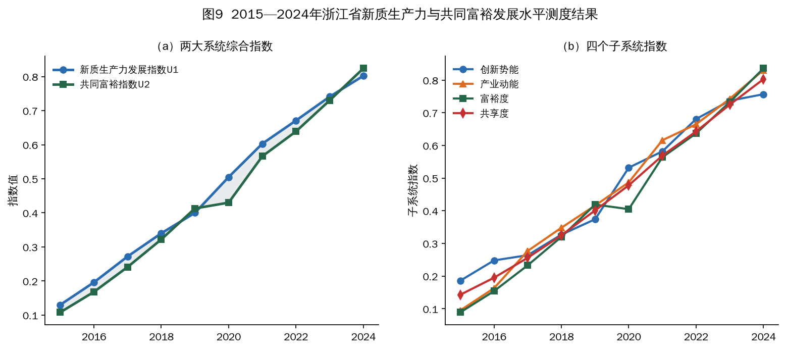

图10 2015—2024年浙江省新质生产力与共同富裕发展水平测度结果

注：根据表5测度结果绘制。

2．创新势能维度：由要素积累迈向体系化跃升。创新势能子系统指数由2015年的0.186升至2024年的0.757。一是创新投入强度持续攀升，据历年《浙江省国民经济和社会发展统计公报》与《全国科技经费投入统计公报》，R&D经费投入强度由2015年的2.33%提高到2024年的3.22%，2024年R&D经费达2901.4亿元、居全国第4位，区域创新能力稳居全国第4；二是创新主体规模呈量级扩张，高新技术企业由2015年的7905家增至2024年的4.75万家左右，科技型中小企业累计达13.1万家，以之江实验室、西湖大学为代表的10家省实验室体系与杭州城西科创大走廊构成高能级创新策源载体。教育科技人才一体化改革及“双一流196”工程、“135”人才强省体系建设工程等部署，为势能积蓄提供了持续的制度供给；省委十五届七次全会通过的《关于加快建设创新浙江因地制宜发展新质生产力的决定》进一步明确坚持教育科技人才一体改革发展为主要支撑、科技创新和产业创新深度融合为关键路径、人工智能为核心变量，创新势能的积蓄由要素驱动转向体系驱动。创新势能的不断充注，构成“势能—动能—效能”三阶转化链条的起点。

3．产业动能维度：起点更低、终点更高并实现对创新势能的反超。产业动能子系统指数由2015年的0.095升至2024年的0.831，起点仅约为创新势能的一半，2024年却反超创新势能子系统（0.757），成为本章最具理论意涵的典型化事实之一。一是数字经济核心产业增加值由2015年的3373亿元（占GDP的7.9%）增至2024年的11060亿元（占12.3%），实现总量破万亿元；二是全员劳动生产率由2020年的16.6万元/人升至2024年的22.9万元/人，该指标在熵值法赋权中权重最高（0.3740），表明其在观测期内区分度最大、对指数拉动最强；三是现代化产业体系的高端化特征日益显著，2024年高新技术产业增加值占规上工业比重达69.0%，全省累计培育省级“未来工厂”93家（截至2025年1月）、国家级专精特新“小巨人”企业1807家、居全国第三；同时，民营经济作为动能转换的主体力量持续发力，2024年民营经济增加值占GDP比重达67.4%，规模以上工业民营企业增加值占比达72.4%。产业动能对创新势能的反超表明，成果转化关（关口Ⅰ）在浙江总体保持畅通，创新势能并未淤积为“创新孤岛”，而是较为顺畅地落入产业体系、转化为现实生产能力——这正是三阶转化框架第一阶转化有效性的直接证据。

### （二）共同富裕指数（U2）的总体演变与分维度特征

1．总体演变：起点更低而增速更快的追赶式上升。2015—2024年，共同富裕指数由0.108升至0.824，年均增长25.3%，快于同期新质生产力发展指数的年均增速，同样保持逐年递增。分年度看，2021年是最显著的跃升点：当年U2由0.430升至0.566，单年提升0.136，为观测期内最大年度增幅，恰与中央《关于支持浙江高质量发展建设共同富裕示范区的意见》出台、示范区建设全面启动的时点吻合，显示重大制度安排对共同富裕进程的强劲边际推动；2024年U2达0.824、超过U1（0.802），改变了2020年以来新质生产力发展指数（U1）单边领先的格局。

2．富裕度维度：“做大蛋糕”的总量证据。富裕度子系统指数由2015年的0.089升至2024年的0.836，起点为四个子维度中最低、增幅为四个子维度中最大。据历年《浙江省国民经济和社会发展统计公报》，全省居民人均可支配收入由2015年的35537元增至2024年的67013元；人均地区生产总值2024年达135565元、折合19035美元；居民人均消费支出由24117元增至45107元。富裕度的持续抬升表明，新质生产力驱动下的经济总量扩张（GDP由42886亿元增至90131亿元）切实转化为居民收入与消费能力的同步改善，《建议》所要求的“居民收入增长和经济增长同步”在浙江获得了经验层面的支撑。

3．共享度维度：起点最高、韧性最强的“分好蛋糕”证据。共享度子系统指数由2015年的0.143升至2024年的0.803，起点在四个子维度中仅次于创新势能（0.186）、高于富裕度与产业动能，反映出浙江城乡差距为全国最小省份之一的存量优势（2015年城乡居民收入倍差2.07，同期全国为2.73）。观测期内：农村居民人均可支配收入由21125元增至42786元，连续40年居全国省区第一；城乡倍差由2.07收窄至1.83，明显优于同期全国的2.34；常住人口城镇化率由65.8%提高到75.5%。共享的空间结构亦同步优化，2024年全省居民收入低于全国平均水平的县（区）由8个减少为4个，所有设区市居民收入均超过全国平均水平、为全国唯一。在共享度内部，农村居民人均可支配收入的熵值法权重达0.2465、为共享度诸指标中最高，表明以“富民”为取向的农民增收而非单纯的比值收敛，构成共享度提升的主要驱动，这与省委以“千万工程”为牵引、围绕“富民”统筹推进“强城”“兴村”“融合”的部署逻辑相契合。

4．2020年的“压力测试”：富裕度回落与共享度逆势提升的机制解读。2020年疫情冲击构成对共同富裕系统的一次天然“压力测试”：当年富裕度子系统指数由0.419回落至0.405——GDP增速降至3.6%，居民人均消费支出由32026元降至31295元；共享度子系统指数却由0.401逆势升至0.478——农村居民收入继续增至31930元，城乡倍差由2.01降至1.96、单年收窄0.05为观测期内最大年度降幅。这种“一落一升”的结构分化，揭示了共享维度背后兜底性制度安排的“自动稳定器”机理：转移支付、社会保障等再分配工具在经济下行期对农村居民与低收入群体形成托底，使共享度对外生冲击表现出显著的逆周期韧性。这一制度取向此后进一步固化——2022年12月浙江在全国率先实现低保标准市域同标，11个设区市低保标准均超1000元/月、平均1083元/月；民生支出占一般公共预算支出比重2024年达76.4%。由此可见，共同富裕并非经济增长的被动函数，其共享维度内嵌的制度供给能够在增长波动中独立发挥作用，这为理解就业分配关（关口Ⅱ）的制度修复机制提供了直接的经验注脚。

### （三）两大指数的同步性初检

1．增速与形态的同步性。对比两大指数的演变轨迹，可以提炼三个典型化事实。一是同向性：十年间U1与U2均逐年递增，无任何一年出现方向背离，两大系统呈现“同向共进”的总体格局；二是追赶性：U2年均增长25.3%、快于U1的22.4%，尤其是2021年示范区建设启动后U2加速上行，反映出制度性安排对共同富裕进程的边际拉动；三是收敛性：两大指数的差距在后期趋于收敛，并于2024年出现U2（0.824）对U1（0.802）的反超。

2．相关性的统计证据。计算表明，2015—2024年U1与U2的Pearson相关系数高达0.9941，两大系统在时序上呈现高度线性关联。当然，高相关系数仅说明二者高度同步，并不能识别相互作用的方向与强度，也不能完全排除共同趋势的影响；两系统互动的耦合结构与协调质量，需借助耦合协调度模型加以刻画（详见下一章），支撑共富型发展的跨省域条件组合，则由第九章基于31个省份的fsQCA分析识别。就本章的描述性证据而言，“创新极化—均衡共享”悖论所预言的两大目标此消彼长的情形，在浙江省域尺度上并未出现——创新越活跃的年份，共同富裕指数的提升总体也越显著，这为“共富型新质生产力”概念的经验合理性提供了初步支持。

3．2024年反超的“双向赋能”信号。2024年U2对U1的反超，不宜简单解读为新质生产力发展的相对迟滞，而更宜理解为双向赋能机制开始显性化的信号：如理论框架部分所述，共同富裕通过人力资本积累、内需市场扩容与社会预期稳定三条渠道反哺新质生产力。从经验证据看，2021年浙江家庭年可支配收入10万—50万元群体比例已达72.4%、比2016年提高24.3个百分点，规模庞大的中等收入群体为创新产品与新业态提供了纵深市场；低收入农户人均可支配收入2023年首破2万元、2024年达23830元，连续保持两位数增长（2023年增长13.4%、2024年增长11.1%），收入结构的持续改善有助于扩大人力资本投资的社会基础。当共同富裕水平越过一定阈值后，其对生产力系统的反哺效应趋于增强，两系统由“生产力单向拉动”转向“双向互馈、螺旋上升”——这一判断与省委十五届八次全会确定的2030年目标（居民人均可支配收入9万元左右、城乡居民收入和实际消费水平差距进一步缩小、全社会研发投入强度3.5%以上）所内含的“两手齐抓”逻辑相互印证。

### （四）基于障碍度模型的短板诊断

指数测度回答了“发展到什么水平”，障碍度诊断进一步回答“提升的主要制约在哪里”。依据式(21)测算2015—2024年两大系统各指标的障碍度，主要年份结果如表6所示，全样本期演变如图11所示。

表6　主要年份两大系统各指标障碍度（%）

| 系统 | 指标 | 2015 | 2018 | 2021 | 2024 |
|---|---|---|---|---|---|
| 新质生产力 | R&D经费投入强度 | 25.68 | 28.53 | 27.92 | 30.03 |
| 新质生产力 | 高新技术企业数（取对数） | 10.79 | 11.16 | 13.07 | 17.83 |
| 新质生产力 | 数字经济核心产业占比 | 23.84 | 20.25 | 19.74 | 22.93 |
| 新质生产力 | 全员劳动生产率 | 39.68 | 40.05 | 39.27 | 29.21 |
| 共同富裕 | 居民人均可支配收入 | 22.22 | 21.33 | 19.34 | 19.81 |
| 共同富裕 | 人均地区生产总值 | 18.35 | 17.04 | 19.04 | 17.68 |
| 共同富裕 | 居民人均消费支出 | 25.74 | 26.74 | 26.86 | 23.13 |
| 共同富裕 | 城乡收入倍差 | 3.91 | 4.74 | 5.65 | 8.60 |
| 共同富裕 | 农村居民人均可支配收入 | 25.56 | 25.60 | 23.92 | 21.41 |
| 共同富裕 | 常住人口城镇化率 | 4.22 | 4.55 | 5.20 | 9.38 |

注：障碍度为同一系统内各指标对系统偏离理想水平的贡献占比，各年份同一系统内合计为100%。

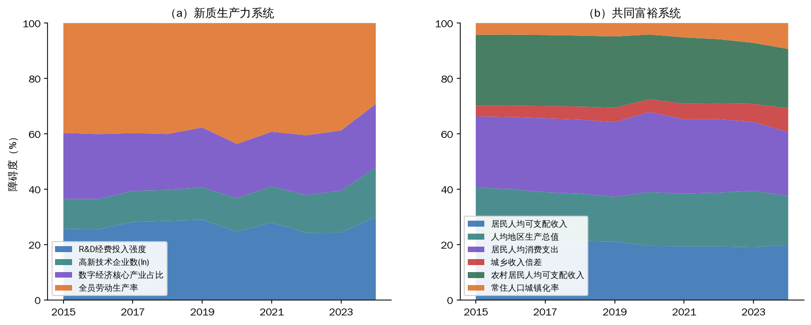

图11 2015—2024年两大系统各指标障碍度演变

注：（a）（b）分别为新质生产力系统与共同富裕系统；依据式(21)测算绘制。

新质生产力系统的障碍结构在2024年发生标志性转换。2015—2023年，全员劳动生产率始终是第一障碍因子（障碍度在37.74%—43.69%之间），反映产出效率对系统水平的持续约束；2024年其障碍度骤降至29.21%，而R&D经费投入强度的障碍度升至30.03%、首次跃居第一障碍因子。这一转换的经济含义在于：随着全员劳动生产率2024年升至22.9万元/人、边际制约明显缓解，创新投入强度取而代之成为下一阶段的首要短板——2024年浙江R&D经费投入强度为3.22%，距省委十五届八次全会提出的2030年3.5%以上目标尚有约0.3个百分点差距，也低于同期广东、江苏水平。此外，高新技术企业数的障碍度由10.79%趋势性升至17.83%，提示在企业数量基数迅速扩大之后，单纯数量扩张的边际信息量趋减，创新主体的质量与能级问题开始显性化。

共同富裕系统的障碍结构呈现“总量类收敛、结构类走高”的清晰迁移。居民人均消费支出、农村居民人均可支配收入、居民人均可支配收入三项总量类指标的障碍度分别由2015年的25.74%、25.56%、22.22%降至2024年的23.13%、21.41%、19.81%；与之相对，城乡收入倍差与常住人口城镇化率两项结构类指标的障碍度分别由3.91%、4.22%升至8.60%、9.38%，十年间均扩大一倍以上。需要强调，这一迁移并不意味着城乡差距在绝对意义上恶化——样本期内倍差由2.07降至1.83——而是表明：当总量类指标随发展水平提高逐步逼近理想区间后，改善速度相对平缓的结构类指标对系统进一步提升的相对制约开始凸显。障碍度诊断由此给出与省委全会“把缩小城乡差距、地区差距、收入差距作为主攻方向”高度一致的实证指向：“十五五”时期共同富裕指数的边际提升，将更多取决于城乡结构性指标的攻坚。

综上，本章的测度结果确立了四个基准事实：其一，新质生产力发展指数与共同富裕指数十年间分别由0.130、0.108升至0.802、0.824，均实现数倍量级的跃升；其二，分维度看，产业动能与富裕度增幅居前、共享度逆周期韧性突出，三阶转化链条的前两阶转化在指数结构上均获得支持；其三，两大指数高度同步（相关系数0.9941），且2024年出现共同富裕指数反超的“双向赋能”信号；其四，障碍度诊断显示，新质生产力系统的第一障碍因子已由全员劳动生产率转换为R&D经费投入强度，共同富裕系统的障碍结构则由总量类指标向城乡结构类指标迁移。两大系统究竟处于何种耦合协调等级、协调水平如何演进，将在第八章运用耦合协调度模型作系统检验。

## 八、实证分析Ⅱ：两大系统耦合协调的时序演进与阶段特征

党的二十届四中全会通过的《建议》明确要求，“推动经济实现质的有效提升和量的合理增长，推动人的全面发展、全体人民共同富裕迈出坚实步伐”，并将“坚持高质量发展”“坚持有效市场和有为政府相结合”确立为“十五五”时期经济社会发展必须遵循的原则；省委十五届八次全会进一步锚定“高质量发展建设共同富裕示范区取得决定性进展，率先呈现基本实现社会主义现代化的生动图景”的总目标。这些部署内在地要求生产力跃迁与共同富裕两大进程相互嵌入、同频共振，而非各自孤立推进。如理论框架部分所述，共富型新质生产力的本质规定性，正在于创新势能能够沿“势能—动能—效能”三阶转化链条顺畅传导，使新质生产力系统与共同富裕系统形成动态耦合、螺旋上升的运行格局。本章在第七章测得的新质生产力发展指数（U1）与共同富裕指数（U2）基础上，运用耦合协调度模型考察2015—2024年浙江省两大系统耦合协调度（D）的时序演进与阶段特征，分解耦合度（C）与综合协调指数（T）的结构性贡献，并将统计事实与浙江实践的制度时序相互印证，以检验理论命题P1（两系统耦合协调度随时间上升），并为命题P2（转化关口修复机制越健全，耦合协调水平越高）提供时序证据。

### （一）时序演进与阶段划分：从轻度失调到优质协调的历史性跨越

测算结果表明，样本期内浙江省新质生产力与共同富裕两大系统的耦合协调度呈单调上升态势，实现了从失调衰退区间向优质协调区间的历史性跨越。第七章表5已完整报告2015—2024年两大指数、耦合度（C）、综合协调指数（T）、耦合协调度（D）及对应协调等级的逐年测算结果，本章据此展开协调水平的时序分析。

从总体演进看，耦合协调度D由2015年的0.345（轻度失调）提高至2024年的0.902（优质协调），十年间年均提升0.062，依据第六章给出的十档等级划分标准，连续跨越濒临失调、勉强协调、初级协调、中级协调、良好协调五个等级，且无一年份出现回调或停滞。与之呼应，两大指数高度同向共进：U1年均增长22.4%、U2年均增长25.3%，两者Pearson相关系数高达0.9941。这一“逐年上升、逐级跨越”的典型化事实，为理论命题P1提供了直接的经验支持——在浙江样本中，新质生产力发展与共同富裕推进不是此消彼长的替代关系，而是相互成就的耦合关系。耦合协调度的演变轨迹如图12所示。

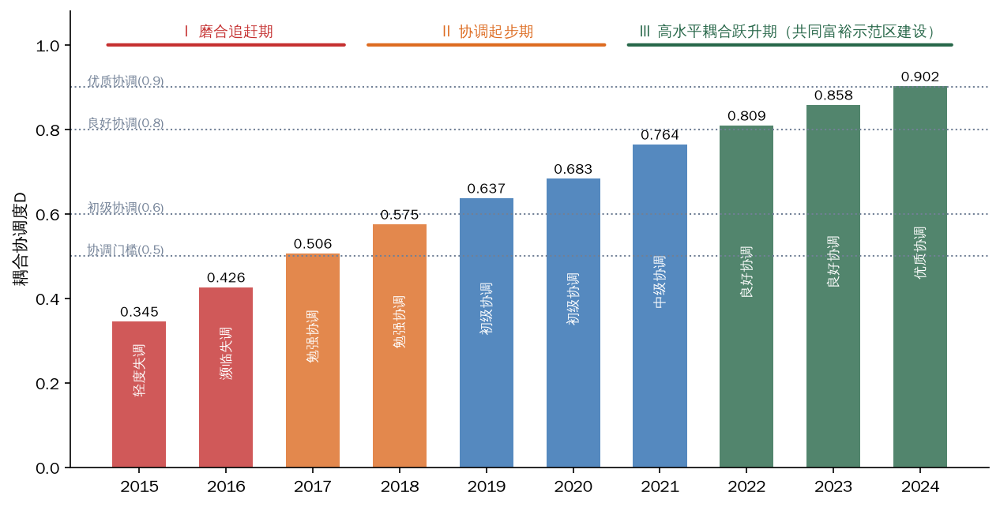

图12 2015—2024年浙江省新质生产力与共同富裕耦合协调度演变

注：根据表5测度结果绘制，柱内文字为对应年份的耦合协调等级。

依据增长斜率与等级跃迁节点，可将十年演进划分为三个阶段，其序列特征与理论框架提出的“低水平耦合—磨合提升—高水平协调”动态演化阶段假说高度吻合。

阶段Ⅰ为磨合追赶期（2015—2017）。D由0.345升至0.506，两年间提升0.161、年均提升逾0.08，跨过D＝0.5的协调门槛，由轻度失调经濒临失调进入勉强协调。此阶段的突出特征是“双低起点、快速爬坡”：2015年U1仅为0.130、U2仅为0.108，两系统发展水平均处低位，失调的根源不在于关联薄弱而在于总量不足。同期浙江密集布局创新与治理基础设施——2016年杭州城西科创大走廊启动建设、“最多跑一次”改革启动，2017年数字经济“一号工程”实施、之江实验室成立——创新势能与产业动能开始系统性积蓄，为后续等级跃迁奠定了要素基础。

阶段Ⅱ为协调起步期（2018—2020）。D由0.575升至0.683，2019年进入初级协调。此阶段的关键考验在于外生冲击下的韧性：2020年疫情冲击使全省GDP增速回落至3.6%，U2增速明显放缓（由0.413升至0.430），其中富裕度子指数由0.419回落至0.405，但共享度子指数由0.401逆势升至0.478，转移支付、兜底保障等再分配安排发挥了“稳定器”作用（浙江此后于2022年12月在全国率先实现低保标准市域同标，11个设区市低保标准均超1000元/月）；同期U1在R&D经费投入强度升至2.88%、数字经济核心产业增加值占比升至10.9%的支撑下继续攀升（由0.400升至0.505），使D在极端冲击之年仍提升0.046、守住初级协调等级。这一“共享度对冲富裕度”的结构性事实表明，共同富裕系统内部的再分配机制不仅是分配结果的改善工具，也是两系统耦合关系的韧性来源。

阶段Ⅲ为高水平耦合跃升期（2021—2024）。D由0.764升至0.902，阶段内连续跨越中级、良好、优质三个台阶。2021年6月，中央《关于支持浙江高质量发展建设共同富裕示范区的意见》印发，浙江成为全国唯一的共同富裕示范区；同年2月，数字化改革全面启动。制度供给的密集注入与协调等级跃迁在时间上高度耦合：2021年D＝0.764，恰为由初级协调跃入中级协调的转折之年；至2024年D达0.902，首次进入优质协调区间，标志着两大系统进入高水平耦合的新阶段。示范区建设作为一次高强度的制度冲击，其时点与耦合协调曲线斜率抬升、等级加速跨越的拐点相互印证，构成命题P2的重要时序证据。

### （二）结构分解：高位耦合、协调指数驱动的演进逻辑

从模型构造看，耦合协调度D由耦合度C与综合协调指数T共同决定，二者经济含义迥异：C刻画两系统交互关联的紧密程度，T刻画两系统整体发展水平的高低。对D作结构分解，可以获得三个层层递进的典型化事实。

一是耦合度C全程高位运行，两系统始终强关联。C在样本期内始终保持在0.996以上，2018年起多数年份达到1.000，表明浙江的新质生产力发展从起点上就深度嵌入民生场景与共富制度安排，两系统之间不存在“两张皮”式的脱钩状态。但高耦合不等于高协调：2015年C高达0.996而D仅为0.345，其原因在于T仅为0.119，属于典型的“高关联、低水平”耦合形态。这正是理论框架所警示的低水平耦合状态——链条虽通，但流量不足。

二是D的提升几乎完全由T驱动，属于“整体抬升型”协调。在C近于1的条件下，D近似等于T的平方根，因而T由0.119升至0.813，构成D提升的主导来源。这意味着浙江耦合协调水平的跃升，不是依靠两系统关联强度的边际改善，而是依靠两大系统发展水平的同步做大。子系统层面的证据更为直观：创新势能指数由0.186升至0.757，产业动能指数由0.095升至0.831，富裕度指数由0.089升至0.836，共享度指数由0.143升至0.803，四个子系统无一短板掉队。这种“整体抬升型”协调区别于依赖单一系统扩张的“单极拉动型”格局，表明“势能—动能—效能”链条各环节在浙江大体保持了同步扩容。

三是两大指数的相对位势在期末发生逆转。样本期内U1在多数年份领先于U2，2019年两指数曾短暂交叠（0.400对0.413），2020年疫情之年U1对U2的领先幅度一度扩大至0.075；至2024年，U2（0.824）明显反超U1（0.802）。按照理论框架的双向赋能命题，这一逆转具有标志性意义：共同富裕对新质生产力的反哺效应开始显现，人力资本积累、内需市场扩容与社会预期稳定正在由发展之“果”转化为创新之“因”，成为新一轮创新势能积蓄的投入要素。当然，单一省域的时序数据尚不足以对反哺渠道作严格的因果识别，条件组合层面的进一步检验详见下一实证章。

### （三）机制归因：三大转化关口的接续修复与制度供给的时序印证

习近平总书记指出，“发展新质生产力，必须进一步全面深化改革，形成与之相适应的新型生产关系”。耦合协调度的十年跃升并非市场自发演化的结果，其背后是浙江围绕三大转化关口（成果转化关、就业分配关、人力资本反哺关）的接续制度供给。将实践考察章梳理的政策时序与本章测得的等级跃迁节点相互对照，可以对耦合协调跃升作出机制归因。

一是成果转化关的修复畅通了势能向动能的转化，支撑U1快速攀升并抑制地区差距扩大。数字经济“一号工程”、以10家省实验室为骨干的高能级科创平台体系，使创新投入持续转化为产业产出：R&D经费投入强度由2015年的2.33%升至2024年的3.22%（R&D经费2901.4亿元、居全国第4位），高新技术企业由0.79万家增至4.75万家左右，数字经济核心产业增加值由3373亿元（占GDP的7.9%）增至11060亿元（占12.3%）。尤为关键的是，山海协作工程以“产业飞地”“科创飞地”“消薄飞地”修复了转化链条的空间断点：20年来山区26县获援助资金近1000亿元、落地产业合作项目12438个、总投资7305亿元，18个产业飞地签约共建、30个消薄飞地实现26县全覆盖；2023年山区26县GDP全部超百亿元、增速高于全省1个百分点。创新势能没有被锁定在高能级城市形成“创新孤岛”，而是沿制度化通道向欠发达地区外溢，这是D在快速上升过程中未因地区分化而受阻的关键。

二是就业分配关的修复使产业动能沉淀为富民效能，直接推动共享度子系统与协调指数T的抬升。《建议》要求“使居民收入增长和经济增长同步、劳动报酬提高和劳动生产率提高同步”，浙江以“千万工程”、扩中提低改革与强村富民集成改革先行探路：城乡居民收入倍差由2015年的2.07持续收敛至2024年的1.83（同年全国为2.34）；低收入农户人均可支配收入2023年达21440元、增长13.4%并首破2万元，2024年达23830元、增长11.1%，持续快于面上居民收入增速；2024年经营性收入50万元以上行政村占比达60%，强村公司发展至2278家、村均分红15.4万元（2025年）；2021年家庭年可支配收入10万—50万元群体比例达72.4%、较2016年提高24.3个百分点。“增长不增收”断点的持续修复，构成共享度指数由0.143升至0.803的微观机理，也是2020年冲击之年共享度逆势上升的制度基础。

三是人力资本反哺关的修复启动了效能向势能的回流，是期末U2反超U1的深层原因。浙江以教科人一体化改革贯通教育链、人才链与创新链，城乡义务教育共同体覆盖所有乡村学校，民生支出占一般公共预算支出比重由2023年的75.5%提高至2024年的76.4%，公共服务的均等化供给将分配改善持续转化为人力资本积累，为创新浙江建设储备高质量要素。分配端的改善由此不再是转化链条的终点，而成为新一轮势能积蓄的起点，“势能—动能—效能—势能”的闭环初步成形。

四是贯穿三大关口的“有为政府×有效市场×有感社会”制度转化器，系统性降低了各关口的转化成本。党的二十届四中全会将“坚持有效市场和有为政府相结合”列为重要原则，浙江样本提供了先行注脚：从数字经济“一号工程”到共同富裕示范区再到创新浙江建设的规划接续，体现有为政府的战略耐心；民营经济增加值占GDP达67.4%（2024年），体现有效市场的配置效率；从“最多跑一次”改革到“1+5+2”数字化改革体系，体现有感社会的治理触达。制度供给密度与D的等级跃迁节点在时序上高度对应——2016—2017年一批创新平台与改革举措落地，对应D跨越0.5协调门槛；2021年示范区获批与数字化改革启动，对应D跃入中级协调并开启阶段Ⅲ的加速跃升——为命题P2提供了省域时序层面的初步印证。

### （四）相对发展度：从“共富滞后”到“同步发展”的形态转换

耦合协调度回答了两大系统“协调水平多高”，相对发展度进一步回答“谁快谁慢”。依据式(22)测算的相对发展度β及类型判别结果如表7与图13所示。

表7　2015—2024年浙江省两大系统相对发展度及类型判别

| 年份 | U1 | U2 | β＝U1/U2 | 类型判别 |
|---|---|---|---|---|
| 2015 | 0.130 | 0.108 | 1.208 | 共同富裕相对滞后 |
| 2016 | 0.196 | 0.168 | 1.167 | 共同富裕相对滞后 |
| 2017 | 0.272 | 0.241 | 1.127 | 共同富裕相对滞后 |
| 2018 | 0.340 | 0.322 | 1.057 | 同步发展 |
| 2019 | 0.400 | 0.413 | 0.968 | 同步发展 |
| 2020 | 0.505 | 0.430 | 1.172 | 共同富裕相对滞后 |
| 2021 | 0.603 | 0.566 | 1.065 | 同步发展 |
| 2022 | 0.671 | 0.639 | 1.050 | 同步发展 |
| 2023 | 0.741 | 0.730 | 1.014 | 同步发展 |
| 2024 | 0.802 | 0.824 | 0.973 | 同步发展 |

注：判别标准：β＞1.1为共同富裕相对滞后型，0.9≤β≤1.1为同步发展型，β＜0.9为新质生产力相对滞后型。

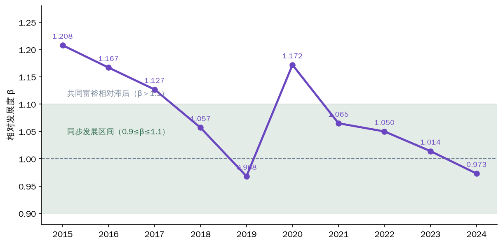

图13 2015—2024年相对发展度β的演变轨迹

注：依据式(22)测算绘制；阴影带为同步发展区间（0.9≤β≤1.1）。

样本期内β呈现“高位回落—扰动回摆—稳态收敛”的三段轨迹。2015—2017年，β由1.208降至1.127，两大系统处于共同富裕相对滞后状态——这一阶段创新势能加速积蓄而富民效能尚未充分释放，与三阶转化链条的传导时滞特征相符。2018—2019年，β进入同步发展区间并于2019年首次降至1以下（0.968）。2020年β回升至1.172，为样本期内唯一一次显著回摆：疫情冲击下富裕度扩张放缓，而数字经济逆势扩张推动新质生产力指数加速上行，系统同步性出现暂时性偏离。2021年共同富裕示范区建设启动后，β重新进入同步区间并逐年下行——2021年1.065、2022年1.050、2023年1.014、2024年0.973，收敛于1附近。十年间β的偏离幅度由0.21收窄至0.03以内，“同步发展型”判别已连续四年保持，这构成命题P1的又一结构性佐证；2024年β首次在同步区间内降至1以下，与共同富裕指数反超新质生产力指数互为表里，标志着双向赋能格局中反哺回路的边际力量开始显现。

### （五）灰色关联分析：赋能通道的指标级识别

依据式(23)与式(24)，以共同富裕指数U2为参考序列计算新质生产力各指标的灰色关联度，以新质生产力指数U1为参考序列计算共同富裕各指标的灰色关联度，结果如表8所示。

表8　两大系统各指标与对方系统综合指数的灰色关联度

| 新质生产力系统指标 | 与U2的关联度 | 共同富裕系统指标 | 与U1的关联度 |
|---|---|---|---|
| 数字经济核心产业占比 | 0.587 | 居民人均可支配收入 | 0.568 |
| 高新技术企业数（取对数） | 0.583 | 常住人口城镇化率 | 0.568 |
| R&D经费投入强度 | 0.582 | 人均地区生产总值 | 0.567 |
| 全员劳动生产率 | 0.582 | 城乡收入倍差（取倒数） | 0.565 |
| — | — | 农村居民人均可支配收入 | 0.564 |
| — | — | 居民人均消费支出 | 0.560 |

注：分辨系数ρ取0.5；各序列经初值化处理。

结果传递出三点信息。第一，全部关联度均高于0.55，处于较强关联区间，从指标层面印证了两大系统的深度嵌套——任何单项指标的变动都与对方系统的综合演进保持着实质性关联。第二，在新质生产力一侧，数字经济核心产业占比与共同富裕指数的关联度居首（0.587），说明数字经济是新质生产力向共同富裕传导最直接的产业通道，这与浙江自2003年“数字浙江”部署、2017年数字经济“一号工程”以来的实践线索高度吻合，也与组态分析中数字普惠金融作为核心条件的发现相互呼应。第三，在共同富裕一侧，居民人均可支配收入与常住人口城镇化率与新质生产力指数的关联度并列最高（0.568），提示共同富裕反哺新质生产力的主通道，在于收入增长带来的内需扩容与城镇化推进带来的要素集聚，恰与理论模型中反哺强度η₁的界定（人力资本积累、内需扩容与预期稳定）形成印证。同时应如实说明：灰色关联度的取值域较窄（0.560—0.587），排序差异幅度有限，上述通道识别应视为方向性证据而非精确的强弱排序。

### （六）稳健性与敏感性检验

测度与耦合协调结论是否依赖于特定的方法选择，需要系统检验。本节从赋权方法（熵值法改为等权重）、标准化参数（上下限拓展幅度由±10%调整为±5%、±15%）与指标体系（逐一剔除单项指标复算）三个维度进行敏感性分析，结果如表9与图14所示。

表9　不同情境下耦合协调度D的测算结果

| 年份 | 基准（±10%，熵值法） | 等权重 | 拓展±5% | 拓展±15% | 逐一剔除单指标区间 |
|---|---|---|---|---|---|
| 2015 | 0.345 | 0.393 | 0.285 | 0.381 | 0.334—0.364 |
| 2016 | 0.426 | 0.461 | 0.392 | 0.448 | 0.419—0.443 |
| 2017 | 0.506 | 0.530 | 0.487 | 0.518 | 0.493—0.518 |
| 2018 | 0.575 | 0.591 | 0.568 | 0.578 | 0.562—0.586 |
| 2019 | 0.637 | 0.643 | 0.639 | 0.635 | 0.631—0.645 |
| 2020 | 0.683 | 0.696 | 0.697 | 0.672 | 0.673—0.699 |
| 2021 | 0.764 | 0.763 | 0.786 | 0.748 | 0.758—0.768 |
| 2022 | 0.809 | 0.805 | 0.838 | 0.788 | 0.806—0.814 |
| 2023 | 0.858 | 0.849 | 0.891 | 0.832 | 0.855—0.860 |
| 2024 | 0.902 | 0.888 | 0.939 | 0.873 | 0.895—0.905 |

注：与基准情形的协调等级一致率：等权重90%、拓展±5%70%、拓展±15%80%。

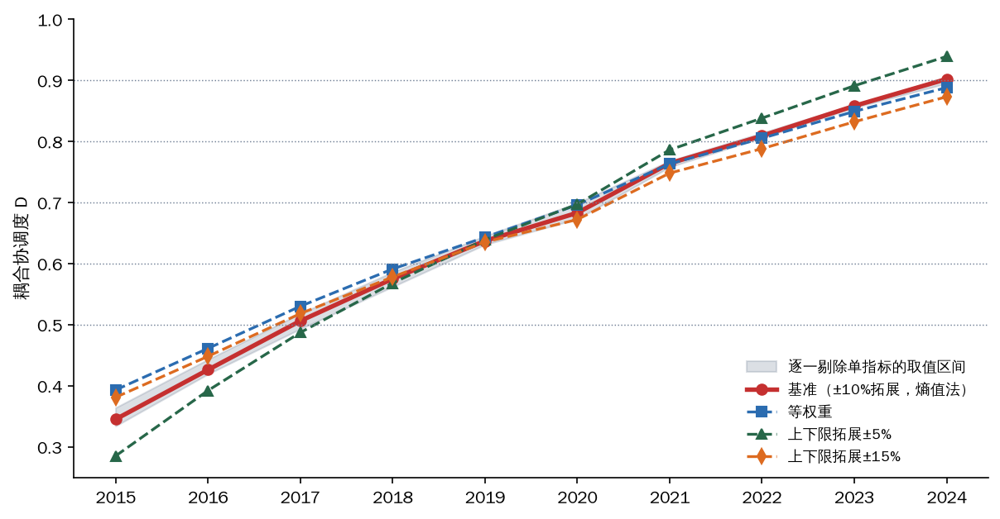

图14 不同情境下耦合协调度D的敏感性比较

注：阴影带为逐一剔除单项指标情形下D值的取值区间。

检验结果支持三点结论。第一，演进形态高度稳健。四种情境下D均逐年单调上升且无一年份回调，2015年均处于失调区间、2024年均达到0.873以上的高位区间，“持续上升、逐级跃迁”的总体判断不依赖于任何特定的方法选择，命题P1的检验结论在方法扰动下保持不变。第二，等级判定在边界年份存在一定的方法敏感性。与基准情形相比，等权重、拓展±5%、拓展±15%情形下的协调等级一致率分别为90%、70%、80%，不一致年份集中于D值贴近等级门槛的年份；其中2024年基准值0.902判为优质协调，拓展±5%情形（0.939）同为优质协调，而等权重（0.888）与拓展±15%（0.873）情形则处于良好协调区间上端。这提示2024年的等级归属处于“良好协调向优质协调跃升的临界带”，对“优质协调”的表述宜在“迈过门槛”的意义上谨慎理解，本报告的结论部分亦以演进形态而非单一等级作为主要论断依据。第三，指标体系稳健。逐一剔除任何单项指标后，各年份D值的波动区间均很窄，2024年落于0.895—0.905之间，全样本期区间带宽最大不超过0.03，表明测度结果不受任何单一指标支配。

需要指出的是，时序对应只能提供机制归因的初步证据：单案例的时间序列既难以回答“哪些条件组合构成高共富绩效的充分路径”，也无法完全排除共时性混杂因素的干扰。省委十五届八次全会强调“把缩小城乡差距、地区差距、收入差距作为主攻方向”，浙江经验能否在全国坐标系中定位、其组态结构是否具有多元等效性，尚需跨省比较证据加以检验。命题P2的组态化检验与命题P3的验证，详见第九章基于全国省份样本的fsQCA分析。

## 九、实证分析Ⅲ：共富型发展的多元组态路径——基于31个省份的fsQCA

党的二十届四中全会通过的《建议》明确要求“以新发展理念引领发展，因地制宜发展新质生产力”。“因地制宜”的政策要求，内在地承认了区域要素禀赋的差异性与发展路径的多样性：不同省份的创新基础、市场结构、人口空间格局各不相同，共富型新质生产力的培育因而不应存在“唯一最优解”，而更可能表现为多种条件组合的“殊途同归”。省委十五届八次全会提出“把缩小城乡差距、地区差距、收入差距作为主攻方向”，也要求在全国坐标系中审视浙江路径的独特性与可推广性。这正是理论框架部分提出的命题P3——共富型发展存在多元等效组态路径——的现实指向。前两章基于浙江时序数据，证实了新质生产力发展指数（U1）与共同富裕指数（U2）的高水平耦合协调；但单一省份的时序证据尚不足以回答“何种条件组合能够产生高共富绩效、浙江居于其中何种位置”这一比较性问题。为此，本章将视野拓展至全国31个省份，运用模糊集定性比较分析（fsQCA）识别共富型发展绩效的组态路径，检验命题P3，并对“浙江组态”作全国定位。

### （一）研究设计：样本、变量与校准

fsQCA的方法论适配依据与模型细节已在第六章详述，此处不赘。共富型发展是创新、金融、人力资本、市场结构、空间格局等多要素联动作用的复杂系统结果，各要素间存在互补与替代关系，组态视角恰能刻画这种多重并发的组态性因果。本章直接说明样本、变量测量与校准安排，并报告组态分析结果。

本章以31个省（自治区、直辖市）为案例（不含港澳台）。结果变量为共富绩效指数，采用熵值法合成居民人均可支配收入（2024年，权重0.83）与城乡居民收入倍差（2024年，逆向指标，权重0.17），兼顾“富裕”与“共享”双重规定性，与浙江时序测度中共同富裕指数的富裕度、共享度维度保持理论同构。条件变量共5个，其选取严格对应“势能—动能—效能”三阶转化框架：一是创新投入强度，以R&D经费投入强度（2023年，%）表征创新势能的积蓄强度（福建、西藏为官方经费与官方GDP推算值，广西、甘肃、青海、黑龙江为2022年官方值）；二是数字普惠金融，以北京大学数字普惠金融指数（2023年）表征金融要素的普惠供给能力〔R:guofeng〕，其既催化势能向动能转化，又将增长收益输往小微主体与低收入群体，同时作用于成果转化关与就业分配关；三是人力资本水平，以每10万人口大学（大专及以上）文化程度人数（2020年七普）表征势能存量与人力资本反哺关的运行基础；四是民营经济活力，以中国民营企业500强入围数（2025年榜单，以2024年营收为据）表征有效市场的发育程度与产业动能的微观载体；五是城镇化水平，以常住人口城镇化率（2024年，%）表征就业容量与公共服务的空间承载。条件变量在时点上先于或同期于结果变量，一定程度上缓解了反向因果的干扰。

校准采用直接校准法，以样本95%、50%、5%分位数分别作为完全隶属、交叉点与完全不隶属锚点，隶属度恰为0.5的案例调整为0.501以避免其在真值表分析中被剔除。各变量校准锚点如表10所示。

表10　校准锚点

| 变量 | 完全隶属(95%) | 交叉点(50%) | 完全不隶属(5%) |
|---|---|---|---|
|共富绩效指数|0.792|0.242|0.073|
|创新投入强度|3.96|2.08|0.70|
|数字普惠金融|458.71|384.24|357.91|
|人力资本水平|30406|14880|10986|
|民营经济活力|70.5|5.0|0.0|
|城镇化水平|87.11|66.14|55.38|

### （二）单条件必要性分析

组态分析之前，须先检验各单一条件是否构成结果的必要条件，判定门槛通常为一致性0.9。检验结果如表11所示。

表11　单条件必要性分析（一致性/覆盖度）

| 条件 | 高共富绩效 | 非高共富绩效 |
|---|---|---|
|创新投入强度|0.845/0.846|0.470/0.556|
|~创新投入强度|0.556/0.470|0.869/0.869|
|数字普惠金融|0.871/0.843|0.494/0.566|
|~数字普惠金融|0.551/0.480|0.863/0.888|
|人力资本水平|0.753/0.779|0.541/0.662|
|~人力资本水平|0.673/0.554|0.819/0.797|
|民营经济活力|0.810/0.842|0.490/0.601|
|~民营经济活力|0.616/0.505|0.871/0.844|
|城镇化水平|0.851/0.850|0.497/0.586|
|~城镇化水平|0.586/0.496|0.873/0.874|

注：~表示条件的非集（逻辑“非”）。

表11传递出两点关键信息。第一，无论对高共富绩效还是非高共富绩效，所有单一条件的一致性均低于0.9，不存在必要条件。这意味着任何单一要素——包括通常被寄予厚望的创新投入——都不足以单独解释共富绩效的高低，必须转入组态视角考察条件间的联动匹配，这本身构成对命题P3的初步支持。第二，在非高绩效一端，“~创新投入强度”的一致性达0.869、“~城镇化水平”达0.873，已接近必要条件量级，呈现出典型的“短板逻辑”：创新投入不足与城镇化滞后几乎是非高绩效省份的普遍特征。反向观之，创新投入与城镇化是共富型发展“缺之难成”的基础性条件；但“缺之难成”并不等于“有之必成”——这一非对称性将在后文N4组态中得到直接印证。

### （三）高共富绩效组态：“创新—人才引领型”与“创新—民营协同型”

构建真值表时，设定案例频数阈值为1（与31个案例的中等样本规模相适应）、原始一致性阈值为0.8、PRI一致性阈值为0.7。分析得到两条高共富绩效组态，总体解一致性0.955、总体覆盖度0.704，即两条路径能够解释七成以上的高共富绩效案例集合，解的解释力较强。结果如表12所示。

表12　高共富绩效组态

| 条件 | S1 | S2 |
|---|---|---|
|创新投入强度|●|●|
|数字普惠金融|●|●|
|人力资本水平|•| |
|民营经济活力| |•|
|城镇化水平|●|●|
|一致性|0.956|0.980|
|原始覆盖度|0.605|0.620|

注：●=核心条件存在，•=边缘条件存在，⊗=核心条件缺失，○=边缘条件缺失，空白=条件可有可无。高共富绩效总体解一致性0.955、总体覆盖度0.704。

组态S1可命名为“创新—人才引领型”：以创新投入强度、数字普惠金融、城镇化水平为核心条件，辅以人力资本水平的边缘存在，一致性0.956、原始覆盖度0.605，典型省份为北京、上海、天津、重庆、江苏、浙江、湖北、广东、陕西。该路径的内在机理是：高强度研发投入积蓄创新势能，富集的人力资本承接并放大势能，数字普惠金融与高城镇化提供转化与共享的管道和载体，多见于直辖市与科教资源富集省份。组态S2可命名为“创新—民营协同型”：核心条件与S1相同，边缘条件由人力资本替换为民营经济活力，一致性高达0.980、原始覆盖度0.620，典型省份为北京、上海、天津、重庆、江苏、浙江、福建、山东、湖北、广东。该路径的机理在于：活跃的民营经济作为科技成果产业化与就业吸纳的微观主体，同时打通成果转化关与就业分配关，使创新势能经由市场机制顺畅沉淀为居民收入。

进一步考察简约解可以发现，两条路径共享“创新投入×数字普惠金融×城镇化”这一核心条件组合，可称为高共富绩效的“核心三件套”。以三阶转化框架观照，其结构含义十分清晰：创新投入是势能之源，居于转化链条的起点；数字普惠金融是要素供给与普惠传导的双重管道，作用于关口Ⅰ与关口Ⅱ；城镇化则是就业容量扩张与公共服务可及的空间载体，支撑关口Ⅱ与关口Ⅲ的运转。而人力资本与民营经济活力互为替代性的边缘条件，表明在核心三件套齐备的前提下，既可以依托人才存量、也可以依托民营市场活力完成势能的承接与转化——两条路径等效通达高共富绩效，“殊途同归”的等效性正是组态因果的典型特征。两条路径的条件构型与典型案例分布如图15所示。

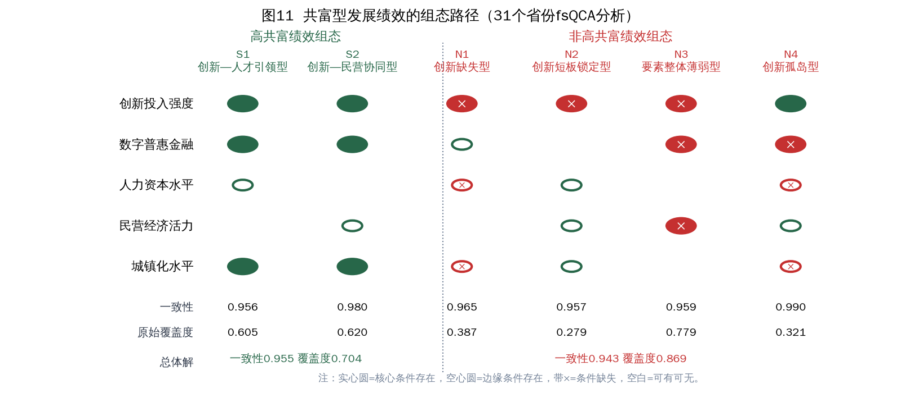

图15 共富型发展绩效的组态路径（31个省份fsQCA分析）

注：实心圆表示核心条件存在，空心圆表示边缘条件存在，带×表示相应条件缺失，空白表示条件可有可无。

尤须深描的是“浙江组态”。其一，真值表中一致性最高的组态为“五条件俱全”型（覆盖8个案例，一致性0.986、PRI一致性0.968），浙江与北京、上海、江苏、广东等同属之；浙江同时落入S1与S2两条路径，属于典型的全要素协同案例。其二，在五个条件中，民营经济活力是浙江最具辨识度的条件：2025年中国民营企业500强浙江入围107家、连续27年居全国第一；2024年民营经济增加值占GDP的67.4%，规模以上工业民营企业5.5万家、占92.7%，增加值占72.4%。其三，其余条件同样处于高隶属区间：2024年浙江R&D经费2901.4亿元、居全国第4，投入强度3.22%；数字经济核心产业增加值11060亿元、占GDP的12.3%；常住人口城镇化率75.5%；城乡居民收入倍差1.83，明显优于全国的2.34。据此，“浙江组态”可概括为“创新引领×数字金融×民营活力×城乡融合”的全要素协同型。值得注意的是，浙江的创新投入强度并非全国极值——2024年北京R&D强度达6.58%、上海4.35%，均远高于浙江，但两市城乡倍差分别为2.32和2.04；浙江以并非最高的创新投入取得了突出的共富绩效（2024年居民人均可支配收入67013元、城乡倍差1.83），说明共富绩效并不取决于单项条件的极值，而取决于条件之间的耦合协同与转化链条的完整贯通——这正是“共富型新质生产力”概念的经验映像。

### （四）非高绩效组态、因果非对称性与稳健性检验

对非高共富绩效的组态分析得到四条路径，总体解一致性0.943、总体覆盖度0.869，如表13所示。

表13　非高共富绩效组态

| 条件 | N1 | N2 | N3 | N4 |
|---|---|---|---|---|
|创新投入强度|⊗|⊗|⊗|●|
|数字普惠金融|•| |⊗|⊗|
|人力资本水平|○|•| |○|
|民营经济活力| |•|⊗|•|
|城镇化水平|○|•| |○|
|一致性|0.965|0.957|0.959|0.990|
|原始覆盖度|0.387|0.279|0.779|0.321|

注：符号含义同表12。非高共富绩效总体解一致性0.943、总体覆盖度0.869。

四条组态呈现出差异化的“失灵图谱”。N1为“创新缺失型”（典型省份：江西、河南、海南），数字普惠金融以边缘条件存在，但创新投入核心缺失、人力资本与城镇化边缘缺失——徒有普惠传导的管道而无创新势能可供传导。N2为“创新短板锁定型”（典型省份：山西、内蒙古），人力资本、民营经济活力与城镇化均以边缘条件存在，要素基础并不薄弱，唯创新投入核心缺失，资源型经济结构对创新投入的挤出使发展势能难以更新。N3为“要素整体薄弱型”（典型省份：吉林、黑龙江、广西、贵州、云南、西藏、甘肃、青海、宁夏、新疆），创新投入、数字普惠金融、民营经济活力三项核心缺失，其覆盖度高达0.779，是非高绩效的主体形态。

最具理论价值的是N4“创新孤岛型”（典型省份：河北、湖南、四川），其一致性在全部组态中最高（0.990）：创新投入作为核心条件存在，但数字普惠金融核心缺失、人力资本与城镇化边缘缺失；即便民营经济具备一定活力（边缘存在），也无法替代转化配套的系统性缺位。这一组态为理论框架的“转化关口失灵”命题提供了直接的截面证据：有势能积蓄而无转化条件，创新投入便被困于“孤岛”，成果转化关与就业分配关双重梗阻，研发投入停留于统计意义上的“强度”而未能沉淀为居民可支配收入。它同时印证了必要性分析揭示的“有之未必成”——创新投入是共富型发展的基础性条件而非充分条件。由此反观浙江，第八章测得的U1与U2优质协调并非创新投入的自然溢出，而是转化关口被制度供给持续修复的结果；一旦转化配套缺位，同样的投入完全可能落入N4的结果集合。

组态结果还呈现出鲜明的因果非对称性：高绩效与非高绩效的组态并非彼此的镜像——创新投入在S1、S2中为核心存在条件，在N4中同样核心存在，结果却截然相反，说明条件的作用方向依赖于其所处的组态语境。其政策含义在于：既不能以高绩效组态的简单否定来推断失败成因，也不能指望补齐单一短板即可扭转全局，关口修复必须成组推进。

稳健性方面，将原始一致性阈值提高至0.85、PRI阈值提高至0.75后重新分析：高绩效组态由2条减为1条，保留“创新—民营协同型”（PRI较低的S1边缘变体被剔除），且所有条件方向不变；非高绩效组态结构基本不变。结果具有稳健性。进一步看，在更严苛阈值下留存的恰是S2——其一致性（0.980）本就更高，表明“创新—民营协同型”是更为稳健的高共富绩效路径，这对民营经济第一大省浙江具有特别的印证意义。

### （五）命题检验结论与浙江路径的全国坐标

本章实证结果对命题P3构成明确支持：高共富绩效存在“创新—人才引领型”与“创新—民营协同型”两条等效组态路径，总体覆盖度0.704；人力资本与民营经济活力之间存在替代关系，条件组合的等效性、核心三件套的共享性与因果的非对称性共同表明，共富型发展是多元条件联动的组态性结果。同时，N4“创新孤岛型”组态表明，创新投入存在而转化配套缺失的省份稳定落入非高绩效集合，这为命题P2“转化关口修复机制越健全、耦合协调水平越高”提供了截面组态证据，与第八章的时序证据形成互证。结合第七、八章对浙江时序证据的检验，“势能—动能—效能”三阶转化框架的经验效度获得了全国截面维度的补强。

就全国坐标而言，浙江与广东、江苏同处“双路径覆盖、五条件俱全”的第一方阵，但组态内部的比较优势各异。以2024年数据观之，广东城乡倍差为2.31、江苏为2.04，浙江为1.83；浙江创新投入强度（3.22%）低于广东（3.60%）与江苏（3.36%），共富绩效却不遑多让——2024年浙江所有设区市居民收入均超过全国平均水平（全国唯一），居民收入低于全国平均的县（区）由8个降为4个，农村居民收入连续40年居全国省区第一。这表明浙江路径的独特性不在创新投入的绝对强度，而在转化链条的完整性与共享机制的健全性：民营经济承担就业与分配的传导功能，数字普惠金融与城乡融合承担空间均衡的传导功能，恰与粤苏形成“强投入引领”与“强转化均衡”的路径分野。

浙江路径的可推广性应作分层讨论。一是对N3“要素整体薄弱型”省份，当务之急是夯实基础条件，数字普惠金融基础设施、城镇化载体与市场主体培育应先行，不宜脱离禀赋单兵突进地追求研发投入指标。二是对N4“创新孤岛型”省份，症结不在创新投入总量而在转化配套，政策重心应从“加大投入”转向“修复关口”——培育民营经济生态、发展数字普惠金融、提升人力资本与城镇化质量；浙江经验中科技成果转化体系、民营经济制度供给与山海协作式空间传导机制的组合逻辑，对此类省份最具借鉴价值。三是对N2“创新短板锁定型”资源型省份，关键在于以创新投入激活存量要素，防止发展路径的低水平锁定。同时须正视边界条件：浙江的民营经济活力植根于深厚的历史积淀与制度演化，难以短期移植；但S1路径的存在表明，以人力资本为替代性抓手同样可以通达高共富绩效。组态路径的等效性本身，就是对《建议》“因地制宜发展新质生产力”的学理注脚——各省份不必也不能复制浙江的全要素协同，而应立足自身禀赋，在等效路径中择宜而行，循序补齐“创新投入×数字普惠金融×城镇化”的核心三件套。本章确立的组态证据与浙江坐标，将在第十章的粤苏鲁浙四省对照中得到更精细的刻画，并为第十一章“十五五”路径设计提供实证依据。

## 十、省际比较：粤苏鲁浙坐标中的浙江方位

第九章的组态分析在全国31个省份的坐标系中定位了浙江的路径类型，但组态分析以集合隶属为语言，对头部省份之间的量级差异刻画较粗。本章聚焦广东、江苏、山东三个经济大省，与浙江作精细对照。选择粤苏鲁作为参照系的理由有三：其一，2024年四省地区生产总值分列全国前四位（广东14.16万亿元、江苏13.70万亿元、山东9.86万亿元、浙江9.01万亿元），同为10万亿元级或准10万亿元级经济体；其二，四省同处东部沿海，均为制造业与创新大省，资源禀赋与发展阶段最具可比性，可在“发展水平相近”的控制条件下辨识浙江路径的独特结构；其三，四省在fsQCA分析中均落入或接近高共富绩效集合，比较的焦点因此从“能否达成”转向“以何种结构达成”，恰与理论模型关于均衡的多参数实现方式（命题M3）相对应。

### （一）总量、人均与分配：三重坐标的错位

表14报告了四省的主要指标对照。

表14　粤苏鲁浙四省主要指标对照

| 指标 | 浙江 | 广东 | 江苏 | 山东 |
|---|---|---|---|---|
| 地区生产总值（亿元） | 90131 | 141634 | 137008 | 98566 |
| 人均地区生产总值（元） | 135565 | 111469 | 160694 | 97368 |
| 居民人均可支配收入（元） | 67013 | 51474 | 55415 | 42077 |
| 居民收入与人均GDP之比（%） | 49.4 | 46.2 | 34.5 | 43.2 |
| 城乡居民收入倍差 | 1.83 | 2.31 | 2.04 | 2.14 |
| R&D经费投入强度（%） | 3.20 | 3.54 | 3.29 | 2.59 |
| 数字普惠金融指数 | 453.78 | 426.48 | 438.61 | 404.79 |
| 每10万人口拥有大学文化程度人数（人） | 16990 | 15699 | 18663 | 14384 |
| 中国民营企业500强入围数（家） | 107 | 51 | 90 | 51 |
| 常住人口城镇化率（%） | 75.5 | 75.9 | 75.5 | 66.5 |

注：地区生产总值、人均地区生产总值、居民人均可支配收入、城乡居民收入倍差、常住人口城镇化率为2024年数据；R&D经费投入强度、数字普惠金融指数为2023年数据；每10万人口拥有大学文化程度人数为第七次全国人口普查数据；民营企业500强入围数为全国工商联2025年榜单；居民收入与人均GDP之比由前两行计算取得。资料来源与第九章fsQCA省际数据集一致。

三重坐标呈现出耐人寻味的错位。总量坐标上，浙江居四省之末，与粤苏存在数万亿元量级的差距；人均产出坐标上，江苏以160694元居首，浙江以135565元次之；而在居民收入坐标上，浙江以67013元反居四省之首，分别高出江苏11598元、广东15539元、山东24936元。更具信息量的是“居民人均可支配收入与人均地区生产总值之比”：浙江为49.4%，高于广东（46.2%）、山东（43.2%），更显著高于江苏（34.5%）。该比值虽同时受产业结构、人口流动方向与统计口径等因素影响，只能作为分配转化效率的粗略度量，但四省间高达15个百分点的差距仍具有明确的结构含义：浙江每一单位人均产出转化为居民可支配收入的比例在四省中最高，江苏“高产出—中收入”与浙江“中产出—高收入”形成鲜明对照。以理论模型的语言表述，这正是劳动报酬份额λ(θ₂)与再分配机制共同作用的直接观测——浙江就业分配关（关口Ⅱ）的传导效率在头部省份中具有显著优势。

### （二）均衡维度：“共同”坐标上的领先优势

若说收入坐标上浙江的领先是量的领先，均衡坐标上的领先则是结构性的。2024年浙江城乡居民收入倍差为1.83，显著低于江苏（2.04）、山东（2.14）与广东（2.31）；浙江农村居民人均可支配收入达42786元、连续多年居全国省区第一，全省所有设区市居民收入均超过全国平均水平。四省对照的启示在于：经济总量、创新投入乃至人均产出的领先，并不自动转化为城乡均衡的领先——广东研发投入强度四省最高而城乡倍差亦为四省最高，表明创新势能的空间分布与富民效能的空间可及之间存在明显张力；浙江则在人均产出并非最高的条件下实现了收入与均衡的双重领先。这一“均衡溢价”正是共同富裕示范区建设的省际显示度所在，也印证了理论模型的判断：城乡差距的走向并非由技术进步本身决定，而是由公共服务均等化等制度参数θ₃决定。

### （三）要素结构：投入强度与转化配套的省际分野

从条件变量的省际结构看，四省呈现清晰的分野。创新投入维度，广东（3.54%）、江苏（3.29%）领先，浙江（3.20%）居第三，山东（2.59%）明显偏低；人力资本维度，江苏（每10万人口18663人）居首，浙江（16990人）次之；而在转化配套维度，浙江全面领先——数字普惠金融指数453.78居四省之首，中国民营企业500强入围数107家，超过江苏（90家）与广东、山东（各51家）之和的一半以上，凸显民营经济活力的断层优势。四省要素结构的雷达图如图16所示。

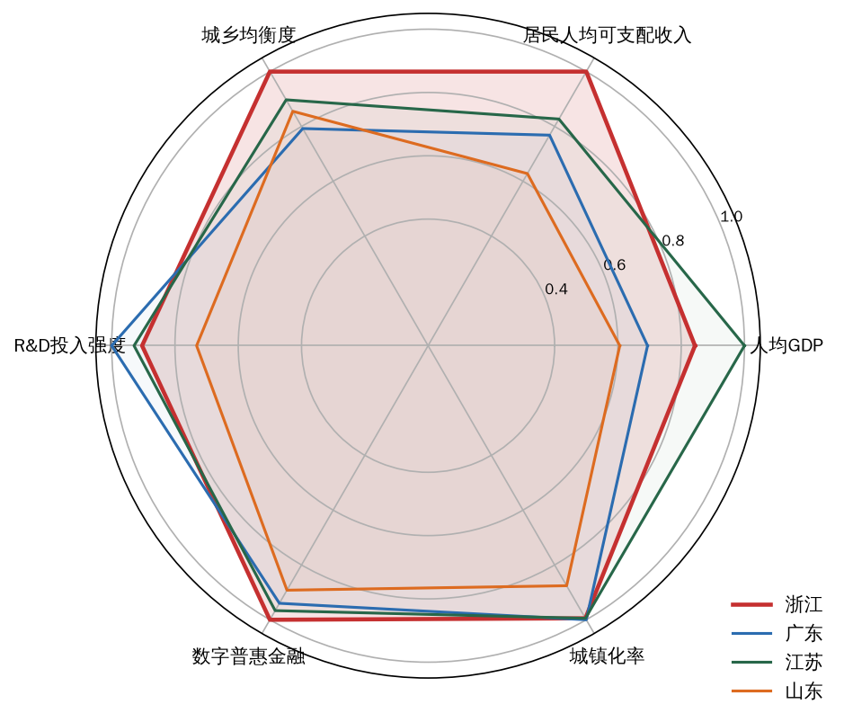

图16 粤苏鲁浙四省发展格局雷达图

注：各维度按四省最大值归一化；城乡均衡度为城乡居民收入倍差的倒数；指标年份口径同表14注。

以三大转化关口的参数结构解读，四省呈现差异化的组合形态：广东近似“强势能—弱均衡”结构，创新投入与知识生产（θ₀）全国领先，但城乡倍差最高，人力资本反哺关（θ₃）的短板明显，其省域内部珠三角与粤东西北的梯度落差构成结构性约束；江苏近似“强势能—中转化”结构，人均产出与人力资本居首，但居民收入与人均产出之比四省最低，就业分配关（θ₂）的传导存在折损；山东呈“投入追赶”结构，研发强度与城镇化率均有明显差距，处于势能积蓄期；浙江则呈“全链条均衡”结构——单项要素除民营活力与数字金融外多不居首，但势能、动能、效能三个环节无显著短板，转化链条的完整性最高。这一省际证据直接支持模型命题M3：相近的发展绩效可以由不同的参数组合实现，而浙江组合的独特性在于以最强的转化配套弥补非最强的投入强度，恰是“创新—民营协同型”（S2）组态的典型形态。

### （四）浙江方位与“十五五”的追赶点

综合四省对照，浙江在共富型新质生产力坐标系中的方位可以概括为：居民收入最高、城乡差距最小、民营经济最活跃、数字金融最普惠的“转化效率高地”，同时是创新投入强度与人均产出存在追赶空间的“势能提升在途者”。这一方位判断的政策含义是双向的：一方面，浙江的比较优势在关口而不在源头，“十五五”时期须格外警惕转化优势的边际递减——民营经济活力与数字金融的领先幅度可能随其他省份的追赶而收窄；另一方面，浙江的首要追赶点在创新投入强度，障碍度诊断（第七章）显示R&D经费投入强度已于2024年跃居新质生产力系统第一障碍因子，与本章的省际对照互为印证，省委十五届八次全会提出的2030年全社会研发投入强度3.5%以上目标，正是对这一短板的针对性部署。“固转化之长、补投入之短”，构成第十一章路径设计的省际坐标依据。

---

## 十一、“十五五”路径：深化共富型新质生产力发展的浙江方略

党的二十届四中全会指出，“‘十五五’时期在基本实现社会主义现代化进程中具有承前启后的重要地位”，要求“推动经济实现质的有效提升和量的合理增长，推动人的全面发展、全体人民共同富裕迈出坚实步伐”。省委十五届八次全会确立了“高质量发展建设共同富裕示范区取得决定性进展，率先呈现基本实现社会主义现代化的生动图景”的“十五五”总目标；按照《建议》起草说明的阐释，这一时期是浙江持续夯实基础、全面发力、突破提升、高质量发展建设共同富裕示范区的决定性阶段。本报告的实证分析表明：浙江新质生产力发展指数（U1）与共同富裕指数（U2）的耦合协调度（D）已由2015年的0.345（轻度失调）跃升至2024年的0.902（优质协调），2024年U2（0.824）反超U1（0.802）、改变了2020年以来U1单边领先的格局，“双向赋能”效应开始显现；fsQCA组态分析进一步揭示，“创新引领×数字金融×民营活力×城乡融合”的全要素协同型组态是浙江高共富绩效的路径底座，而“创新孤岛型”非高绩效组态的存在则警示：转化关口一旦失灵，创新投入本身并不必然带来富民效能。据此，“十五五”时期浙江深化共富型新质生产力发展的总体方略，应当围绕“势能—动能—效能”三阶转化链条，聚焦成果转化关、就业分配关、人力资本反哺关三大转化关口，依托有为政府、有效市场、有感社会“三位一体”的制度转化器，实施六条相互支撑的路径：前两条着力厚积创新势能、畅通成果转化关，第三条与第五条着力打通就业分配关的就业维度与分配维度，第四条着力修复成果转化关的空间断点，第六条着力巩固人力资本反哺关，共同构成从制度供给到量化锚点的完整施工体系，如图17所示。

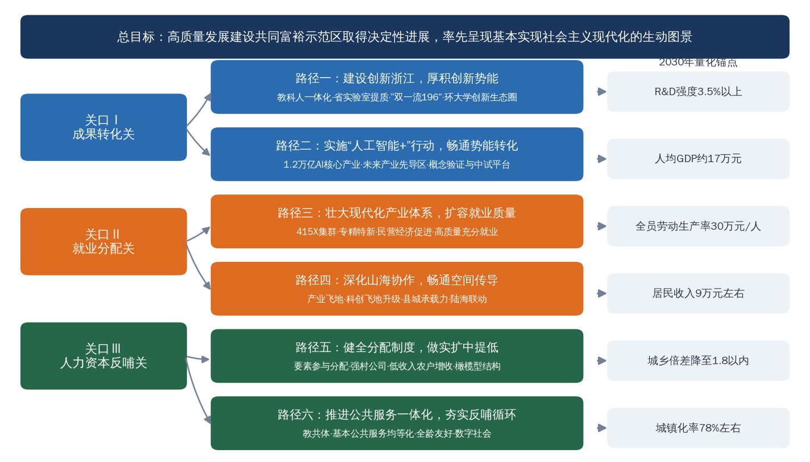

图17 “十五五”时期浙江深化共富型新质生产力发展的路径施工图

### （一）以“创新浙江”建设厚积创新势能

创新势能是三阶转化链条的起点，也是共富型新质生产力的第一性来源。实证结果显示，浙江创新势能子系统指数由2015年的0.186升至2024年的0.757；fsQCA必要性分析中，“创新投入强度缺失”对非高共富绩效的一致性高达0.869、接近必要条件量级，且创新投入在两条高绩效组态中均为核心条件——这意味着创新投入不足几乎必然导致共富绩效不高，厚积创新势能是不可替代的先手棋。这一机理与《建议》“统筹教育强国、科技强国、人才强国建设，提升国家创新体系整体效能，全面增强自主创新能力，抢占科技发展制高点，不断催生新质生产力”的部署高度契合；省委十五届七次全会亦明确坚持教育科技人才一体改革发展为主要支撑、科技创新和产业创新深度融合为关键路径。“十五五”时期的具体抓手：一是深入实施“315”科技创新体系建设工程，做强以之江、西湖等10家省实验室为骨干的战略科技力量，依托杭州城西科创大走廊提升创新策源能力，力争2027年全国重点实验室达到27家以上、每万人高价值发明专利达到25件。二是深化教育科技人才一体改革，实施“双一流196”工程和“135”人才强省体系建设工程，支持浙江大学加快迈向世界一流大学前列、西湖大学建设世界一流新型研究型大学，深化“校（院）企双聘”，完善“科技副总”“产业教授”机制，以人才跨体制流动打通教育链、创新链与产业链。三是保持研发投入的持续爬坡，在2024年R&D经费2901.4亿元、居全国第4的基础上，按照创新浙江2027年R&D强度3.4%以上的阶段目标滚动加力。2030年锚点：全社会研发投入强度达到3.5%以上，为势能向动能、效能的梯次转化提供充沛“位能”。

### （二）以“人工智能+”行动畅通势能向动能转化

成果转化关是“势能—动能”转化的第一道关口，其失灵形态即fsQCA识别出的“创新孤岛型”组态（N4）——有创新投入但数字金融、人力资本、城镇化等转化配套缺失，创新势能困于“孤岛”而无法沉淀为富民效能。浙江产业动能子系统指数由2015年的0.095升至2024年的0.831，是新质生产力发展指数两个子系统中跃升幅度更大者，恰恰说明成果转化体系的畅通是浙江组态区别于“创新孤岛”的关键。《建议》要求“全面实施‘人工智能+’行动，以人工智能引领科研范式变革，加强人工智能同产业发展、文化建设、民生保障、社会治理相结合，抢占人工智能产业应用制高点，全方位赋能千行百业”，并部署“推动量子科技、生物制造、氢能和核聚变能、脑机接口、具身智能、第六代移动通信等成为新的经济增长点”；省委十五届七次全会则明确“人工智能将成为创新浙江的最鲜明标识、最核心支撑”。“十五五”时期的具体抓手：一是纵深推进《浙江省“人工智能+”行动计划（2024—2027年）》，到2027年培育10个以上全国一流垂直行业大模型、500个以上标杆应用场景；夯实算力底座，在2025年底已建成投用总算力超156 EFLOPS的基础上，2026年提升至200 EFLOPS以上。巩固2025年1—11月全省规上人工智能核心产业营收6294亿元、同比增长21.6%的良好势头。二是放大杭州“六小龙”的策源示范效应，以深度求索的大模型、宇树科技的人形机器人、强脑科技的脑机接口、云深处科技的四足机器人等为牵引，超前布局具身智能、脑机接口等未来产业，依托宁波人形机器人创新中心等平台推动前沿技术就地转化。三是健全技术要素市场化配置机制，对标创新浙江2027年技术交易总额5300亿元以上的目标，让创新势能顺着市场通道落入产业体系。2030年锚点：全省规模以上人工智能核心产业营业收入达到1.2万亿元，衔接数字经济2027年增加值7万亿元、核心产业增加值1.6万亿元的阶段目标。

### （三）以现代化产业体系建设扩大高质量就业容量

就业分配关是“动能—效能”转化的枢纽，其断点表现为“增长不增收”。从指标结构看，在新质生产力发展指数中，全员劳动生产率的熵值法权重高达0.3740、居全部指标之首，表明生产率跃升是浙江动能积蓄的主引擎；而生产率红利能否转化为居民收入，取决于产业体系的就业包容度。《建议》要求“坚持把发展经济的着力点放在实体经济上，坚持智能化、绿色化、融合化方向……保持制造业合理比重，构建以先进制造业为骨干的现代化产业体系”，并将“高质量充分就业取得新进展，居民收入增长和经济增长同步、劳动报酬提高和劳动生产率提高同步”列为民生目标；省委十五届八次全会部署“以人工智能为核心变量、以先进制造业为骨干、以现代服务业为重要支撑”打造浙江特色现代化产业体系。“十五五”时期的具体抓手：一是深入实施“415X”先进制造业集群培育工程，以4个万亿级世界级产业群、15个千亿级特色集群和若干百亿级“新星”产业群构建梯度就业载体，依托累计93家省级“未来工厂”和3家灯塔工厂推动“机器换人”与“技能提升”同步，防止智能化改造单向挤出就业。二是壮大专精特新企业方阵这一高质量就业的“蓄水池”，巩固国家级专精特新“小巨人”企业1807家、居全国第三，制造业单项冠军278家、居全国第一的领先优势，使中小企业升级与中等技能岗位创造同频。三是充分激活民营经济这一最大就业容纳器——2024年浙江民营经济增加值占GDP的67.4%，规上工业民企占比92.7%——落实“两个毫不动摇”，支持民企参与新能源、人工智能、低空经济等领域投资，将铁路、核电等领域民企持股比例提高到10%以上，深化杭甬温要素市场化配置综合改革试点，在“十四五”城镇新增就业累计565.13万人的基础上保持就业扩容势头。2030年锚点：全员劳动生产率达到30万元/人左右（2024年为22.9万元/人），且劳动报酬提高与劳动生产率提高同步。

### （四）以缩小“三大差距”为主攻方向健全空间传导机制

成果转化关在空间维度的断点，即创新要素向高能级城市极化而外围县域承接乏力所形成的“创新孤岛”，是地区差距的生成机理；fsQCA简约解显示，创新投入、数字普惠金融与城镇化构成高共富绩效的“核心三件套”，城镇化水平作为核心条件的稳定在场，印证了空间传导机制对共富绩效的枢纽作用。《建议》强调“区域协调发展是中国式现代化的内在要求”；省委十五届八次全会明确“把缩小城乡差距、地区差距、收入差距作为主攻方向，充分运用‘千万工程’蕴含的理念方法机制，聚焦山区海岛县和农村农民，围绕‘富民’统筹推进‘强城’‘兴村’‘融合’三篇文章”，并部署强化陆海联动、山海协作，形成双城牵引、区域协调发展新格局。“十五五”时期的具体抓手：一是推动山海协作工程迭代升级，在20年来山区26县获援助资金近1000亿元、落地产业合作项目12438个的基础上，深化“1+1+1+1”新型结对机制（省领导+经济强县+国企+社会力量），做强18个签约共建“产业飞地”、30个实现26县全覆盖的“消薄飞地”以及丽水共建30块科创飞地的多点布局，以“科创飞地”反向承接高能级城市创新势能的空间外溢。二是增强县域承载力，巩固山区26县GDP全部超百亿、增速高于全省1个百分点的追赶态势，落实“山区23县+2海岛县”动态调整机制，力争2027年山区海岛县数量减至20个以下、居民收入与全省平均之比达到77%。三是放大均衡底盘优势，2024年浙江居民收入低于全国平均的县（区）已由8个降为4个、所有设区市居民收入均超全国平均（全国唯一），设区市居民收入最高最低倍差仅1.54，“十五五”应以都市圈同城化与基础设施联网进一步压缩空间梯度。2030年锚点：常住人口城镇化率达到78%左右，全省人均地区生产总值和城乡居民收入接近发达经济体水平、缩小“三大差距”取得跨越式成效，山区海岛县居民收入与全省平均之比持续提升。

### （五）以收入分配制度改革释放富民效能

就业分配关的分配维度决定动能红利“分得好不好”。实证发现，2020年疫情冲击下浙江富裕度子指数回落而共享度子指数逆势提升（0.401→0.478），低保市域同标、转移支付等兜底机制发挥了“稳定器”作用；2024年共同富裕指数（U2）反超新质生产力发展指数（U1），改变了2020年以来U1单边领先的格局，说明分配端建设已开始形成对生产端的反哺——这正是“十五五”深化分配改革的实证依据。《建议》要求“使居民收入增长和经济增长同步、劳动报酬提高和劳动生产率提高同步”，分配结构得到优化、“中等收入群体持续扩大”。“十五五”时期的具体抓手：一是深化“扩中提低”改革，浙江已在全国率先划定家庭年收入10万元的中等收入群体线，2021年家庭年可支配收入10万—50万元群体比例达72.4%、比2016年提高24.3个百分点，“十五五”应对照共同富裕示范区实施方案确定的2025年目标（家庭年可支配收入10万—50万元群体比例80%、20万—60万元群体比例45%）持续攻坚并进一步提高标准，健全技能人才、新就业形态劳动者等重点群体的增收激励。二是完善要素参与分配机制，依托杭甬温要素市场化配置综合改革试点，拓宽居民财产性收入渠道，推动数据、技术、知识等新型要素的收益向劳动者合理倾斜。三是做深强村富民集成改革，在全省强村公司达2278家、参股行政村11280个、年利润21.7亿元、村均分红15.4万元的基础上，深化片区组团发展，推动省级重点村片区由226个扩展至2027年的500个以上，巩固集体经济经营性收入50万元以上行政村占比60%的成果；持续实施低收入农户增收行动，保持低收入农户收入两位数增长态势（2024年23830元、增长11.1%；2025年26439元、增长10.9%）。2030年锚点：居民人均可支配收入达到9万元左右，城乡居民收入倍差缩小至1.8以内（规划口径1.77），人均地区生产总值接近发达经济体水平（约17万元）。

### （六）以基本公共服务一体化夯实人力资本反哺

人力资本反哺关决定富民效能能否回流为新一轮创新势能，其断点表现为“低水平循环”并固化城乡差距。fsQCA结果显示，人力资本水平是“创新—人才引领型”高绩效组态（S1）的组成条件，而其缺失则频繁出现在各类非高绩效组态之中；理论框架部分揭示的共同富裕反哺新质生产力三条渠道——人力资本积累、内需市场扩容、社会预期稳定——均以基本公共服务的可及性与均等化为前提。《建议》要求“坚持尽力而为、量力而行，加强普惠性、基础性、兜底性民生建设，解决好人民群众急难愁盼问题，畅通社会流动渠道，提高人民生活品质”，并将“基本公共服务均等化水平明显提升”纳入“十五五”主要目标；省委十五届八次全会亦将“全体人民共享高品质幸福生活更加可感可及”列为“六个重大突破”的重要内容。“十五五”时期的具体抓手：一是深化教育均等化改革，巩固城乡义务教育共同体覆盖所有乡村学校、公办学校结对覆盖率95%以上的成果，使农村人口的人力资本积累速度快于城乡收入收敛速度，从源头阻断“低水平循环”。二是扩面推广舟山、淳安、龙游、景宁“一市三县”基本公共服务一体化试点经验，健全医疗、养老服务的常住地供给机制，夯实基本养老保险参保4757.71万人的制度底座，守住全国率先实现的低保标准市域同标（11市均超1000元/月）底线并稳步提标。三是保持民生投入强度，在民生支出占一般公共预算支出76.4%（2024年）的高位上优化支出结构，将更多资源投向教育、健康等生产性民生领域，巩固户籍人口人均预期寿命82.55岁、居全国省区第一的健康人力资本优势，以稳定的社会预期支撑创新创业的风险承担。2030年锚点：基本公共服务均等化水平明显提升，城乡居民实际消费水平差距进一步缩小，为2035年全省域基本实现共同富裕奠定人力资本与制度基础。

综上，六条路径分别对应“势能积蓄—成果转化—就业吸纳—空间传导—分配优化—人力反哺”六个环节，前后衔接、闭环运转：创新浙江建设与“人工智能+”行动做大转化的“源”与“流”，现代化产业体系与收入分配改革做实转化的“承”与“分”，缩小“三大差距”与公共服务一体化做优转化的“网”与“环”。以有为政府的规划与改革供给、有效市场的民营活力与要素配置、有感社会的数字治理与基层善治为制度转化器，浙江完全有条件在“十五五”时期将耦合协调度稳定在优质协调区间并持续提升，使共富型新质生产力从“实践原型”走向“制度范式”，为全国因地制宜发展新质生产力、扎实推进全体人民共同富裕提供省域先行经验。

## 十二、结论与展望

党的二十届四中全会通过的《中共中央关于制定国民经济和社会发展第十五个五年规划的建议》明确提出，“因地制宜发展新质生产力”，“推动人的全面发展、全体人民共同富裕迈出坚实步伐”；省委十五届八次全会进一步确立了“高质量发展建设共同富裕示范区取得决定性进展，率先呈现基本实现社会主义现代化的生动图景”的“十五五”总目标。本报告围绕新质生产力赋能共同富裕这一重大命题，构建“共富型新质生产力”概念与“势能—动能—效能”三阶转化框架，综合运用熵值法、耦合协调度模型与fsQCA方法对浙江实践展开系统的理论与实证考察。本章归纳主要结论，提炼理论贡献与政策启示，并指出研究局限与未来方向。

### （一）主要结论

围绕理论框架部分提出的三个研究命题，实证检验形成如下结论。一是命题P1获得有力支持，浙江新质生产力与共同富裕两大系统的耦合协调度呈持续上升的历史性跨越轨迹。2015—2024年，新质生产力发展指数（U1）由0.130升至0.802，共同富裕指数（U2）由0.108升至0.824，两者Pearson相关系数达0.9941，呈高度同向共进态势；耦合协调度（D）由2015年的0.345（轻度失调）提升至2024年的0.902（优质协调），年均提升0.062，十年间连续跨越濒临失调、勉强协调、初级协调、中级协调、良好协调五个等级，先后经历磨合追赶期（2015—2017）、协调起步期（2018—2020）与高水平耦合跃升期（2021—2024）三个阶段。二是命题P2得到经验证据的印证，转化关口修复机制与耦合协调水平的提升在时序上高度吻合。2021年共同富裕示范区获批之年D值达0.764，恰为从初级协调跃入中级协调的转折年，此后于2022年、2024年先后跃上良好协调与优质协调两个台阶；2020年疫情冲击下富裕度回落而共享度逆势提升，显示低保市域同标、转移支付等兜底机制发挥了“稳定器”作用；2024年U2（0.824）反超U1（0.802），共同富裕对新质生产力的反哺效应开始显现，理论框架中的“双向赋能”机制获得初步验证；第九章N4“创新孤岛型”组态亦从截面维度反向印证了这一命题。三是命题P3获fsQCA结果确证，共富型发展存在多元等效的组态路径。基于31个省份的组态分析表明，不存在导向高共富绩效的单一必要条件，“创新—人才引领型”（S1）与“创新—民营协同型”（S2）两条路径的一致性分别为0.956与0.980，总体解一致性0.955、覆盖度0.704，创新投入、数字普惠金融与城镇化构成高共富绩效的“核心三件套”；浙江同时落入两条路径，其“创新引领×数字金融×民营活力×城乡融合”的全要素协同型组态在全国坐标中具有鲜明辨识度。反面组态中，“创新孤岛型”（N4，一致性0.990）表明有创新投入而转化配套缺失的省份仍陷于非高绩效，直接印证了三大转化关口失灵的理论判断。

### （二）理论贡献与政策启示

本研究的边际贡献主要有三。其一，在概念层面提出“共富型新质生产力”，将生产力跃迁与生产关系优化统一于同一分析框架，回应了新质生产力“创新极化”倾向与共同富裕“均衡共享”要求之间的理论张力；其二，在机制层面构建“势能—动能—效能”三阶转化框架，以成果转化关、就业分配关、人力资本反哺关三大转化关口刻画链条断点与“三大差距”（城乡差距、地区差距、收入差距）生成机理的对应关系，弥补了既有研究“机制黑箱”与“单向视角”的不足；其三，在经验层面首次对浙江两大系统进行系统性耦合协调测度，并以组态方法定位“浙江路径”的全国坐标，为省域样本的系统化研究提供了可复制的分析范式。政策启示相应有三：一是共富型发展没有唯一模板，各地应立足要素禀赋在多元等效路径中择优组合，避免对单一要素的路径依赖；二是转化关口的制度供给是耦合协调跃升的关键变量，“十五五”时期应以创新浙江建设、“人工智能+”行动与缩小“三大差距”的系统集成，持续降低三大关口的转化成本；三是有为政府、有效市场、有感社会“三位一体”的制度转化器是浙江经验的深层逻辑，其可推广性在于制度组合而非个别政策工具。

### （三）研究局限与未来方向

本研究尚存三方面局限，也构成后续深化的方向。一是fsQCA基于截面数据识别组态，难以刻画条件组合随时间的演化，未来可引入动态QCA方法，考察“十五五”期间各省组态路径的迁移轨迹与浙江组态的稳定性；二是省级加总数据可能掩盖省域内部的结构性差异，后续可构建覆盖山区海岛县的县域面板，对三大转化关口的空间异质性进行更细颗粒度的检验；三是宏观测度尚不能直接打开转化链条的微观过程，未来应结合企业、农户层面的微观调查数据，对成果转化、就业分配与人力资本反哺的微观机制开展因果识别，为共富型新质生产力理论提供更坚实的经验基础。随着“十五五”宏伟蓝图的展开，新质生产力赋能共同富裕的浙江实践必将不断丰富，相关研究亦当与实践同频演进、持续深化。

---

## 参考文献

〔REFLIST〕

---

## 附录　数据来源与口径说明

1. **浙江省时间序列数据（2015—2024年）**：地区生产总值、人均地区生产总值、居民收入与消费、城镇化率、全员劳动生产率、高新技术企业数、数字经济核心产业增加值等均取自历年《浙江省国民经济和社会发展统计公报》（浙江省统计局、国家统计局浙江调查总队发布）；R&D经费投入强度2015—2019年为省统计公报公布数，2020—2024年为《全国科技经费投入统计公报》口径。2025年数据取自《2025年浙江省国民经济和社会发展统计公报》及浙江省统计局年度经济运行发布。

2. **口径注记**：①数字经济核心产业增加值2015—2017年为“信息经济核心产业”口径，官方统计序列可衔接；②常住人口城镇化率、人均地区生产总值自2020年起为第七次全国人口普查修订口径；③全员劳动生产率2019—2021年为公报“预计”数；④高新技术产业占规模以上工业比重因2018年、2023年两次执行新的统计分类目录存在口径断点，故未纳入指数测度，仅在正文作趋势性描述；⑤2018年浙江R&D经费绝对额系按当年公报公布比重（2.52%）与GDP推算。

3. **31个省份截面数据**：居民人均可支配收入、城乡收入倍差（2024年）取自国家统计局分省年度数据及各省统计公报；R&D经费投入强度取自《2023年全国科技经费投入统计公报》及各省科技经费投入统计公报（福建、西藏为官方经费与官方GDP之比的推算值，广西、甘肃、青海、黑龙江为2022年值）；数字普惠金融指数取自北京大学数字金融研究中心《北京大学数字普惠金融指数（2011—2023年）》省级指数（2023年值）；人力资本水平取自第七次全国人口普查公报；民营企业500强入围数取自全国工商联2025年发布榜单；城镇化率取自各省2024年统计公报。

4. **测度方法程序**：熵值法、耦合协调度模型与fsQCA（含校准、必要性分析、真值表构建与Quine-McCluskey布尔最小化）均由课题组以Python编程实现并交叉验证，计算过程与结果表格一一对应。

5. **典型案例素材**：均来自政府官方网站、新华社、人民日报、浙江日报等权威公开报道，关键事实经多来源交叉核验。

